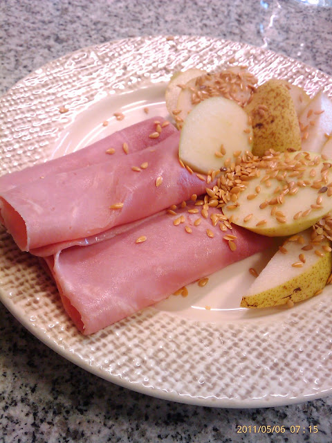
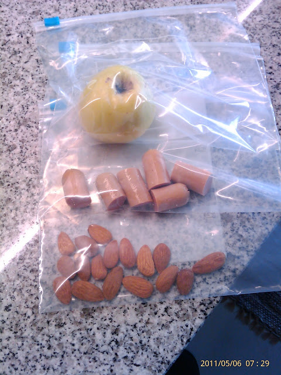

Tive insónias (só consegui dormir 6 horas, o pneu agradece). Estive 1 hora a pensar na Di antes de me levantar.  

  

O primeiro dia foi então assim:

  

Às 7:00 comi fiambre com fruta e sementes de linhaça, no fim um café. Foi estranho não beber leite e deixar a bela da fatia de pão de Campo Maior, mas as sementes de linhaça caíram bem. "Isto vai dar fome", pensei.

  

  

  

Para a merenda a meio da manhã e lanche levei umas amêndoas, fruta e salsichas. "Isto vai dar fome", pensei.

  

  

Às 9:30 já estava com fome. Hora de 7 amêndoas e 1 bravo esmolfe. 

  

Manhã ocupada e às 12:15 já só tenho na cabeça: "Vamos comer. Estou cheio de fome!". 

  

Na cantina a escolha é diversa mas há que respeitar a Di. 

  

\- "Fruta não levo, acabou-se a maçã assada, bem bem, está na hora de meter o chapéu de caçador. (...) O que é que tem feito?"

\- "Bifanas de porco ou salsichas." 

\- "(Salsichas não que já tenho umas no saco). Bifanas se faz favor."

\- "Arroz ou batatas?"

\- "Na na na está bom assim. Tem legumes? (Bah, couve cozida ou feijão verde, tudo cheio de água, passo). Deixe estar obrigado."

  

Pago, encho o resto do prato de salada (tomate, alface, cenoura, beterraba, pimento, cebola, tudo temperado com um fio de azeite). Nunca a carne e a salada me souberam tão bem na cantina. Caminhada antes de voltar ao trabalho. Café. "Isto vai dar fome", pensei.

  

15:30 e já tenho fome. Já há algum tempo que não comia salsichas, mas ajudaram a tapar o buraco, com a ajuda de 5 ou 6 amêndoas. 

  

17:30,

\- "Vamos comer? Estou em sofrimento!"

\- "Ahaha haha mas ainda é o teu primeiro dia!"

\- "Estou em sofrimento."

(...)

  

18:00,

\- "Esta maçã \[já fatiada\] está óptima.". Mais 5 amêndoas de volta ao escritório.

  

20:00 e já estou em casa. 

  

\- "Então a sopa de peixe?"

\- "Só tinhamos duas postas. Fiz sopa de alho francês."

\- "É pá, eu tenho de comer proteinas."

\- "Descongelei 2 bifes."

\- "A sopa tem batata?"

\- "Nunca meto batata na sopa."

  

Fui buscar o cabaz da [Prove](http://www.prove.com.pt/) (primeiro dia) ao carro na esperança que tenha morangos.

  

\- "Uhm belos morangos. (...) Vamos jantar."

\- "Temos de dar sopa à miúda."

\- "É pá, eu tenho de ir comer."

  

Bife de perú, sal, fio de azeite numa frigideira, uma colher de chá de sementes de linhaça. 2 minutos de um lado, 2 minutos do outro e já está. "(Necessito de vegetais. Cabaz a mim, espinafres.)". Lavo um punhado de espinafres, tiro o bife da frigideira, meto os espinafres na mesma, sal.

  

\- "Uhm isto está óptimo."

  

A sopa arrefece, tem falta de sal. Como mais uma concha. Meto os pratos na máquina de lavar.

  

\- "(Falta aqui qualquer coisa. SOS, uma tirinha de chocolate culinária light 70% cacau)".

\- "Não devias comer isso."

\- "Diz aqui em SOS".

  

Tive alguma fome durante o dia, no entanto sinto-me bem e leve. Estou a gostar. 

  

Ainda não comprei a gelatina 10Kcal. Acho que vou cozer um ovo caseiro para a ceia.
