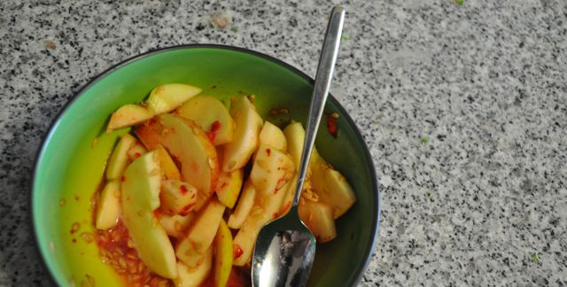

Dia 2, eu e a minha filha o dia sozinhos.

  

Acordei a pensar o que iria comer para o pequeno almoço. Sem sobras do jantar, comi ovos ontem à noite (o que deixa a omelete de fora), só me restava repetir (seca...). Sem grandes alternativas, tentei um sabor diferente fazendo sumo de um morango para envolver os restantes alimentos. Acompanhei com o fiambre. Eram 8:00.

  

  
Por volta das 9:30 a fome começou a surgir, hora de uma fruta e algumas amêndoas.  
  

  

Eram 11:30, ainda tinha de vestir a miúda, ir ao supermercado, a fome apertou. Morangos e (mais) amêndoas.

  

  
14:00,  enquanto a minha mãe deu comer à minha filha (a primeira vez) fiz uns legumes estufados (refogar cebola em azeite, adicionar 1 cenoura laminada, 1 alho francês e brócolos, temperar, tapar e deixar estufar, juntar um pouco de molho de soja e sementes de linhaça e abóbora) acompanhado de um bife de vaca (confesso, que dava para dois, mas a Vânia não gosta). Café.  
  

  

17:00, depois de uma tarde de brincadeira com a Inês e de um iogurte que ela pouco comeu (e de ver um episódio do "Lie to Me"): fome, bastante. Fruta (kiwi, nêspera, morangos), amêndoas e salsichas. Chamei-lhe um figo.

  

  

Fruta não puxa carroça (ou então o meu estômago ainda não está adaptado a estes costumes de caçador/recolector). Meia hora depois, nêspera e sementes de abóbora.

  

  
20:00, jantar para dois. Grelhei 3 hambúrgueres, fiz uma salada de cenoura, alface, coentros, sementes de abóbora, linhaça e sésamo (temperada com azeite e vinagre balsâmico), acompanhados por 4 colheres de sopa de feijão preto. "Só faltava aqui uma fatia de pão", pensei. Aguenta.  
  

  

Café. Saí para comprar gelatina mas não vai ficar pronta a tempo da ceia. Hoje termino o dia com as amigas "Isidoro".

  

O plano alimentar pode tornar-se monótono. Fruta, amêndoas, carne, salada, carne, amêndoas, fruta. Amanhã é dia de omelete e peixe.
