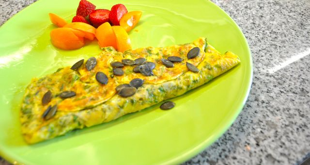
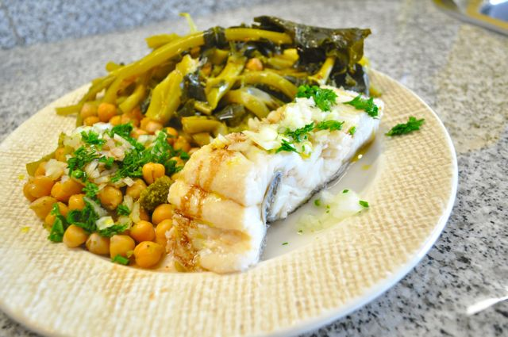

Hoje foi assim (amanhã já é segunda-feira):  
  
Pequeno almoço, omelete de coentros com sementes de linhaça e sementes de abóbora, dois morangos e uma nêspera. Café.  
  

  

  

A meio da manhã, fruta e amêndoas. 

  

Almoço, bacalhau cozinho com grão (4 colheres de sopa), feijão verde e brócolos. Temperado com cebola, salsa, azeite e vinagre balsâmico. Café.

  

  

Lanche, fruta e amêndoas.  
  
Jantar, salada de alface, tomate, ananás e amêndoas, peito de frango estufado com cogumelos, 1/2 copo de vinho branco, café.  
  
Ceia, gelatina.
