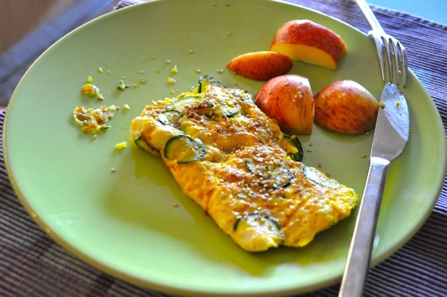
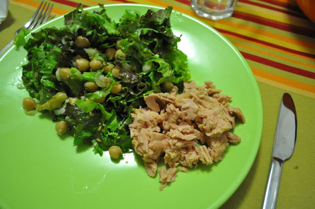
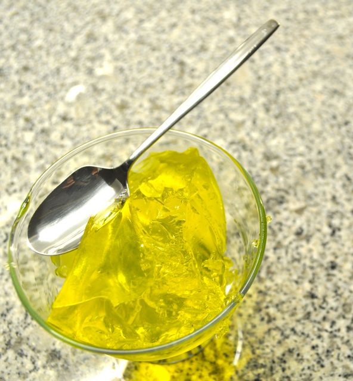

Dia 4,  
  
Depois de uma noite a acordar de hora a hora (ossos do oficio), o dia correu assim:  
  
Pequeno-almoço, omelete de courgette (igual à de ontem, mas com meia courgette cortada muito fina ao invés de coentros, previamente salteada em azeite) acompanhada de uma maçã. Café.  
  

  

A meio da manhã, nêsperas e amêndoas.

  

Almoço, bifes de frango grelhados e uma salada de cenoura, beterraba, tomate, alface, cebola e pepino, temperada de azeite e vinagre. Café.

  

Lanche, pêra, duas salsichas e amêndoas.

  

Quando cheguei a casa a fome estava nos píncaros. Sopa com sementes para "acalmar".

  

Para o jantar, atum ao natural acompanhado por salada de alface, grãos (sobraram de ontem), cebola e sementes de linhaça. Temperada com oregãos, azeite e vinagre. Café.

  

  

Para a ceia, a fresca, a leve, a gelatina.

  

