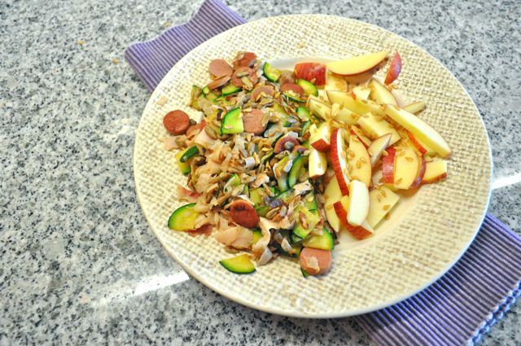
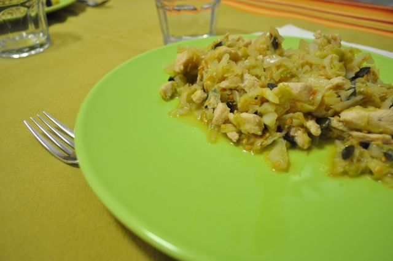

Hoje acordei sem saber o que comer: fruta e fiambre não me apetecia, sobras do jantar não tinha (mesmo que tivesse...) e omelete outra vez estava fora de questão. Resolvi inventar: courgette cortada em quartos de lua finos, sementes de girassol, fiambre e salsichas às rodelas tudo salteado em azeite na frigideira. Acompanhado de fruta e sementes de linhaça. Não tava mau nem bom. Café.  
  

  

A meio da manhã, o habitual: fruta e amêndoas. 

  

Almoço, febras de porto com couve portuguesa cozida e temperada com azeite, vinagre e bastante pimenta. Um pitéu. Café.

  

Para o lanche, o habitual: fruta, uma salsicha e amêndoas.

  

Como é normal, cheguei a casa cheio de fome, comi duas nêsperas enquanto terminava o jantar. Pegando na couve coração e frango estufados que a Vânia estava a fazer, salteei os mesmos em azeite e adicionei molho de soja e sementes de linhaça e abóbora para compor. Estava bom. Café e 1 cm cúbico de chocolate negro 70% cacau.

  
  

  

Para a ceia, como não podia deixar de ser (e principalmente porque ainda há), gelatina.
