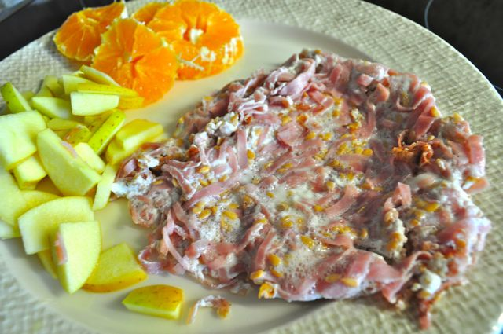
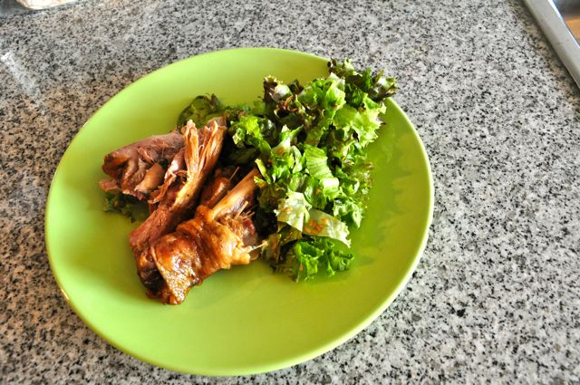

Hoje estava sem saber o que fazer para o pequeno-almoço (assim como ontem...). Sem grandes ideias, resolvi fazer uma omelete de claras com fiambre: separar as claras das gemas, juntar às claras algumas fatias de fiambre cortadas finas, adicionar sementes de linhaça, temperar com alguma pimenta e cozinhar numa frigideira. Acompanhei com fruta. Café.  
  

  

A meio da manhã fruta e amêndoas.

  

Para o almoço, bifes à marinheiro (receita da cantina, sem glúten ou derivados do leite) com salada de beterraba, cenoura, pimento, alface, salada, etc. Café.

  

Para o lanche, fruta e amêndoas.

  

Para o jantar, a Vânia fez uma perna de peru estufada na panela de pressão (não sei o que levou...) acompanhada de salada. Café e 1 cm cúbico de chocolate negro com 70% cacau.

  

  

Fiz duas gelatinas, uma a partir de gelatina em pó e outra mais natural a partir de sumo de maçã e folhas de gelatina. A confecção da última não correu muito bem (vi a receita sem muita atenção num programa qualquer...), se ficar alguma coisa de jeito deixarei a receita noutro dia, quando refinar o processo.

  

Para a ceia, gelatina (se solidificar a tempo) ou salsichas de aves.
