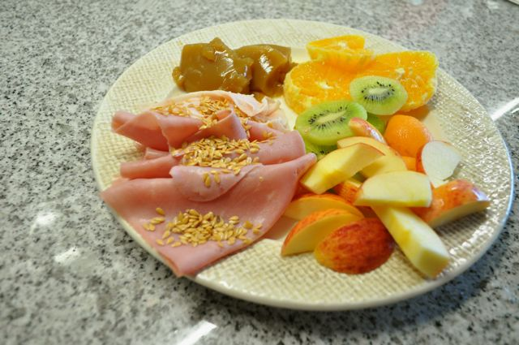
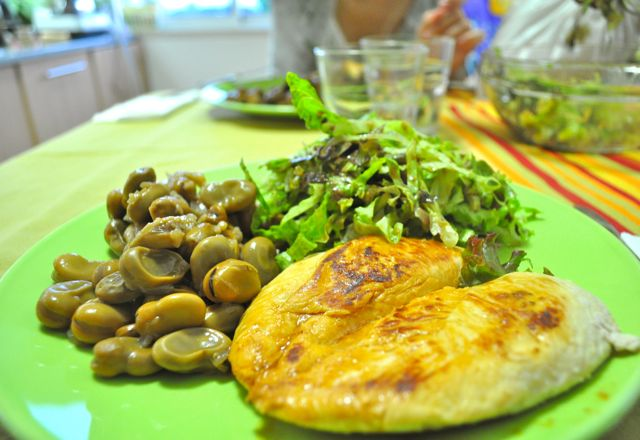

(o Blogger esteve em baixo pelo que este _post_ já vai atrasado)  

  

O dia foi bastante normal face aos restantes:

  

Pequeno-almoço, bastante fruta, fiambre, gelatina natural de fruta e sementes de linhaça. A gelatina foi feita com Granny Smith mas ficou um pouco escura porque não coloquei sumo de limão suficiente. No entanto, o sabor ficou bom. É muito fácil de fazer:

1. Triturar 6 a 8 maçãs mesmo com casca, passar por um passador para filtrar a polpa e ficar só com o sumo (cerca de 500 ml). Adicionar sumo de limão para a fruta não oxidar (algo que correu literalmente mal comigo...).
2. Entretanto colocar 5 folhas de gelatina de molho, durante 5 a 7 minutos.
3. Escorrer as folhas de gelatina e colocar numa frigideira com meio copo de sumo, deixando derreter as folhas em ferver.
4. Adicionar o conteúdo da frigideira ao restante sumo e colocar numa taça.
5. Colocar no frigorifico durante 4 horas para solidificar.

  

A meio da manhã, fruta e amêndoas.

  

Ao almoço comi sardinhas com legumes cozidos. Fiquei com alguma fome pelo que tive de reforçar com uma fatia de ananás. Café.

  

Ao lanche, fruta e amêndoas (abusei um pouco, porque tive alguma fome, das 14 às 19:30 devo ter comido cerca de 20 amêndoas, um pouco mais do que o habitual).

  

Ao jantar, a Vânia tinha feito umas favas simples (cozinhadas apenas com cebola, alhos, azeite e sal) que acompanhámos com uma salada de alface e peito de frango. Café e um quadrad(inh)o de chocolate 70% cacau _light_.

  

  

Ceia, gelatina de morango (de pacote) e gelatina natural de maçã.
