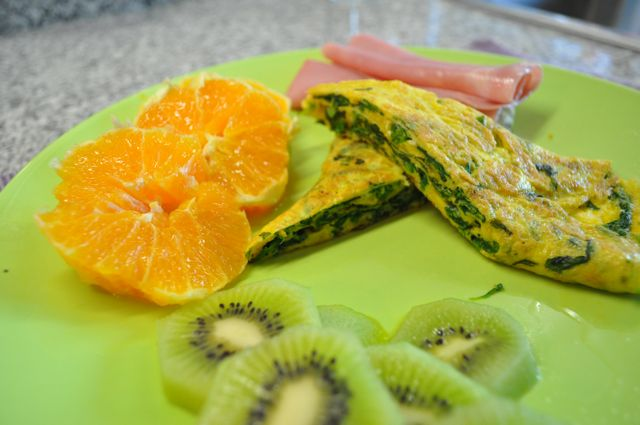
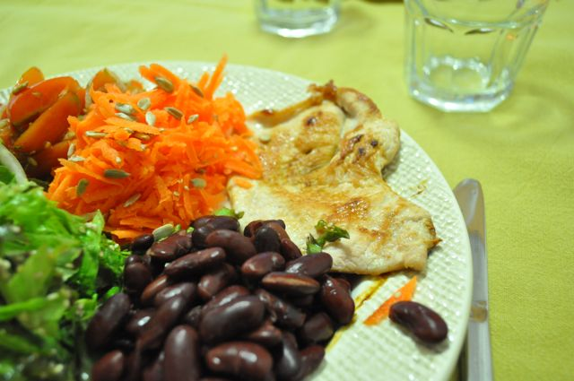

(o Blogger esteve em baixo pelo que este _post_ já vai atrasado)  
  
Faz hoje 1 semana que iniciei a alteração de dieta.  
  
Decidi em cada semana que passe, fazer uma avaliação mais quantitativa, em relação à semana anterior, para medir resultados.  
  

- **Peso**: 85 Kg (menos 2,5 Kg)
- **Perímetro Abdominal**: 102 cm (não medi na semana passada, mas sinto as calças ligeiramente mais folgadas)

  
Em termos qualitativos, sinto-me melhor no geral, mais "leve" e com digestões mais fáceis.  
  
De resto, o dia foi assim:  
  
Pequeno-almoço, omelete de espinafres com "farinha" de linhaça, fiambre e fruta.  
  

  

Notei que as sementes de linhaça não estavam a ser processadas totalmente pelo meu corpo, "saindo" dele inteiras. Decidi triturar as mesmas na Bimby (numa picadora também deve dar) para que ficassem mais fáceis de digerir. Fica muito interessante, parecido a [farofa](http://pt.wikipedia.org/wiki/Farofa), óptima para usar no feijão, etc.

  

A meio da manhã, fruta e amêndoas.

  

Ao almoço, fui almoçar a um self-service chinês (ui ui...). Muita carne, muitos fritos, poucos vegetais e fruta disponíveis. No entanto, tinham carne crua, marisco e vegetais para grelhar pelo que foi a opção que tomei. Fruta e gelatina no final. Comi bastante mais do que o normal mas tive uma digestão fantástica.

  

Lanche, fruta e amêndoas.

  

Para o jantar, salada de tomate com oregãos, cenoura ralada com sementes de abóbora, alface com sementes de sesamo, feijão com farinha de linhaça e bifes grelhados.

  

  

Ceia (hoje deitei-me mais tarde), algumas amêndoas, gelatina e um morango (durante o serão todo).
