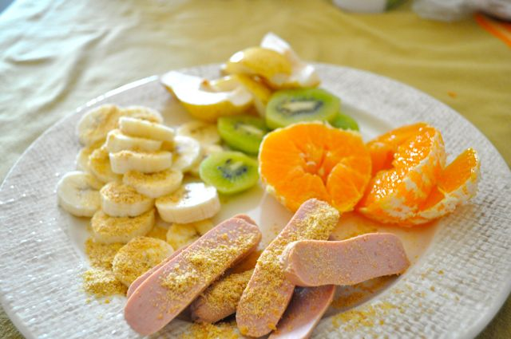
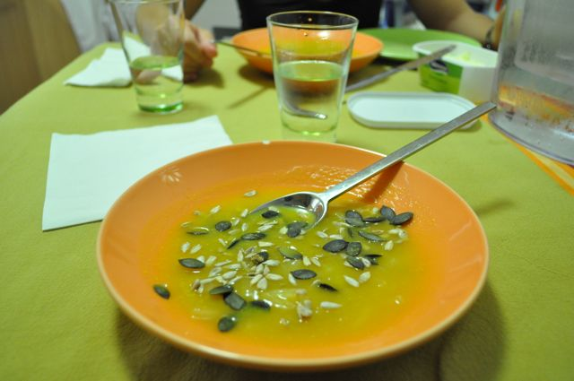

Sábado,  
  
Pequeno-almoço, fruta, salsichas de frango e farinha de sementes de linhaça. Café.  
  

  

Hoje fomos a um churrasco na casa de um colega de trabalho brasileiro. Antes de sair de casa (pelas 13:00) já tinha fome. Comi uma pêra e algumas amêndoas.

  

O churrasco, que durou das 14:00 às 17:30, foi muito bom, excelente hospitalidade e óptima comida. Comi carnes diversas (frango, entrecosto, salsicha toscana, frango e picanha), feijão preto, farofa (de farinha de mandioca), vinagrete (salada de tomate aos cubos, cebola e coentros picados). Até aqui nada mau. O "pior" foram as cervejas a mais e o cálice de cachaça "de alambique".  Estou com uma sensação de cheio e com um ligeiro mau estar. Meti o pé na argola ... agora toca a entrar na linha outra vez. 

  

Para o jantar, como ainda estava cheio, meia sopa de couve coração com algumas sementes de abóbora e girassol.

  

  

Para a ceia, (bah que cheio que me sinto...) fiz uma gelatina de laranja natural (vamos ver se solidifica a tempo e se tenho barriga para tal ...).
