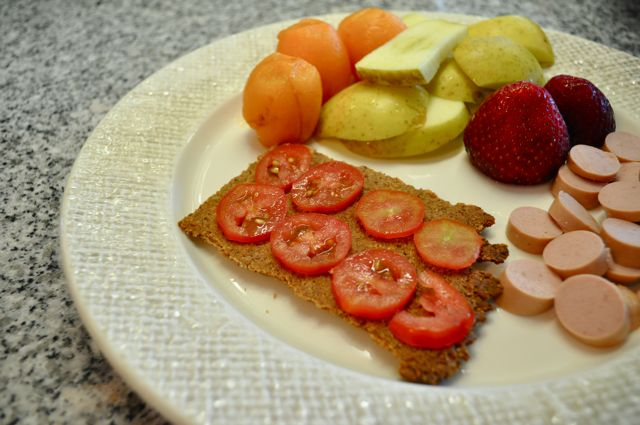
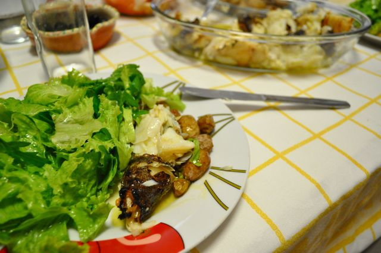
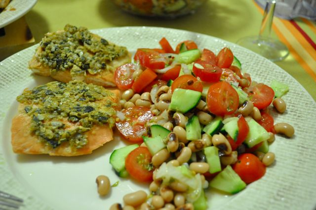

Domingo,  
  
Comecei o dia a fazer umas _crackers_ cuja receita descobri no livro "Paleo eating for modern people". Andava à procura de uma forma de fazer algo parecido com tostas/bolachas mas à base de frutos secos e clara de ovo. Esta receita veio mesmo a calhar. Não ficaram fantásticas (esqueci-me de colocar sal numas e outras não ficaram tempo suficiente no forno). Todavia ficaram comestíveis.  
  
O pequeno-almoço foi fruta, salsichas de perú e uma _cracker_ de alho com tomates cereja fatiados (o mais próximo de um _pan tomaca_ que consegui). A receita das _crackers_ está no fim do _post_.  
  

  

A meio da manhã, fruta e pedacinhos de _cracker_.

  

Almocei na casa dos meus pais. A minha mãe faz um bacalhau assado na brasa com batatas a murro fantásticos. A batata está fora do meu plano alimentar mas como as mesmas eram da horta dos meus pais e pequeninas, não resisti em comer meia dúzia. Abusei na salada de alface, rúcula e hortelã. Uma pequena taça de gelatina e café.

  

  
Lanche, fruta e pedacinhos de _crackers_.  
  
Para o jantar, salmão com cobertura de sementes e farinha de linhaça, acompanhado de uma salada de tomate, pepino e feijão frade (temperado com azeite, vinagre e oregãos).  
  

  

Ceia, gelatina natural de laranja (que não ficou muito bem solidificada...).

  
**_Crackers_ de Alho**  
1 chávena de farinha de amêndoa (amêndoa com casca feita em pó na Bimby ou picadora)  
1 colher de sopa bem cheia de farinha de sementes de linhaça  
1 dente de alho picado  
1 colher de sopa de azeite  
1 clara de ovo  
Sal e pimenta  
  
Misturar bem todos os ingredientes até ficarem bem ligados. Estender com o rolo de massa, entre duas folhas de papel vegetal, marcar as divisões das bolachas com as costas de uma faca. Levar ao forno a 180º, durante 15 a 20 minutos. Deixar arrefecer e quebrar pelas marcações.
