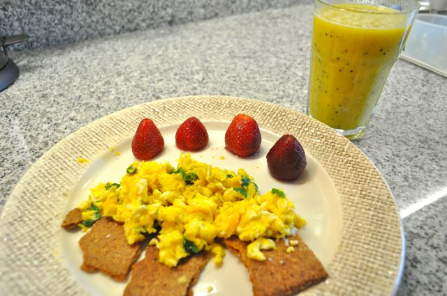
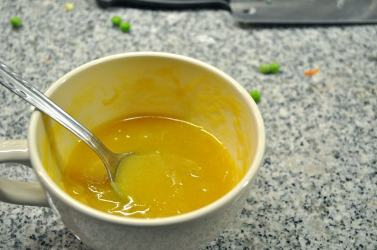
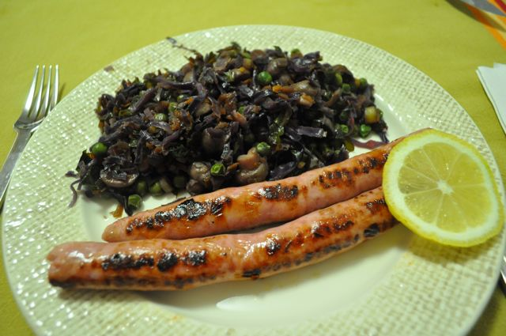

Segunda-feira...

  

Pequeno-almoço, tentei fazer uma aproximação a um pequeno-almoço "normal". _Crackers_ de alho, ovos mexidos com coentros e salsa, morangos e sumo de laranja e kiwi. "Nham nham".

  

  
A meio da manhã, pedacinhos de _crackers_ de sementes de sésamo e fruta. Para fazer estas _crackers_ usa-se 1/3 de chávena de farinha de amêndoa e 1/3 de chávena de sementes de sésamo ao invés do alho (ver receita no _post_ anterior).  
  
Para o almoço, lombo de porco assado no formo com salada mista (cenoura, alface, pepino, pimento, cebola, etc.).  
  
Lanche, fruta e amêndoas.  
  
Saí do trabalho e tive que ir ao supermercado fazer as compras que não fiz no fim-de-semana. Conclusão, cheguei a casa às 20:45 cheio de fome. A Vânia estava a tratar da miúda mas já tinha aquecido a sopa. Foi a minha "entrada".  
  

  

Jantar, jantar, umas salsichas frescas grelhadas e legumes estufados (couve roxa, ervilhas, cenoura, alho francês e folhas de brócolos) com um pouco de molho de soja. Estava um pouco pesado mas não havia mais nada...

  

  

  

Ceia... hoje não há... jantei tarde...
