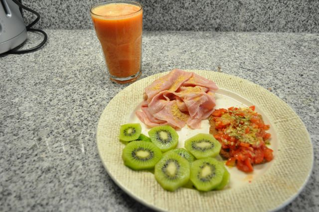

Hoje foi um dia ocupado, muito trabalho, sem tempo para pausas.

  

Pequeno-almoço, sumo de laranja e morangos, fiambre com farinha de sementes de linhaça, kiwis, _cracker_ de alho (ver dia 10) com tomate picado, oregãos, sal e um fio de azeite. Café.

  

  
A meio da manhã, fruta e amêndoas.  
  
Almoço, lombinhos de porco grelhados com couves cozidas (temperadas com azeite, vinagre e pimenta).  
  
Lanche, amêndoas. Tive a tarde toda em reuniões, às 19:00 saí cheio de fome. Passei numa mercearia e comprei 5 ou 6 morangos para a viagem até casa (estavam óptimos).  
  
20:20 e estava em casa. Jantei sopa de feijão verde que a Vânia tinha feito e uma salada de tomate, alface, feijão manteiga, salsichas do jantar de ontem, fatias de fiambre, sementes de abóbora e girassol, farinha de linhaça, tudo temperado com azeite e vinagre de vinho tinto. Um pitéu. Visitas em casa depois de arrumar a cozinha. Café.  
  

  

  
Para a ceia, duas fatias de fiambre de porco e duas fatias de mortadela de perú.
