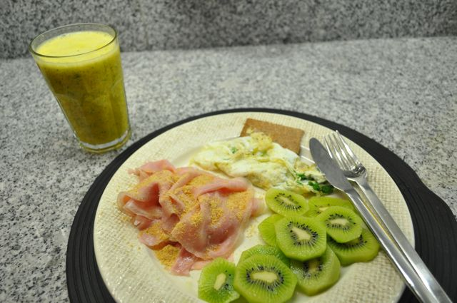
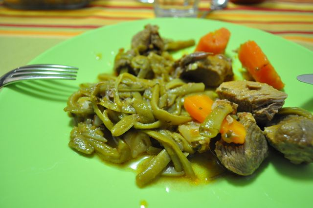

Mais um dia intenso. Reuniões o dia todo, muita coisa para encaminhar. Apesar da dieta aparentemente "ligeira" (sem pão, batata, arroz, doces, etc.), senti-me bastante enérgico.  
  
O dia começou assim: pelas 7:00, sumo de laranja e hortelã, fiambre com farinha de linhaça, omelete de claras com coentros e salsa, meia _cracker_ de alho e dois kiwis.  
  

  

Durante a manhã duas pêras e algumas amêndoas.

  

Ao almoço, entrecosto assado no forno com legumes cozidos. Café.

  

Durante a tarde, um pêssego, um morango e algumas amêndoas.

  

Para o jantar, pelas 20:30, jardineira com feijão verde e cenoura.

  

  
Para a ceia, nada.
