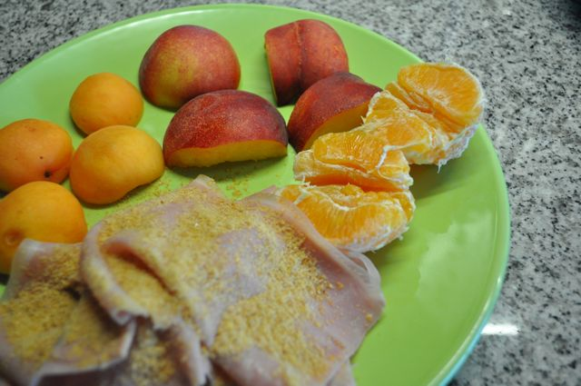
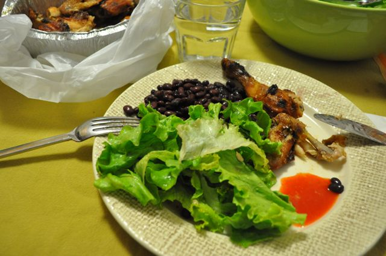

Hoje acordei preguiçoso e tinha loiça para lavar. Por isso, não cozinhei nada, tudo no estado natural. Dois alperces, um pêssego, uma laranja e fiambre com farinha de sementes de linhaça.

  

  
Meio da manhã, uns morangos, amêndoas e um café.  
  
Almoço, solha grelhada com legumes cozidos (brócolos e couves).  
  
Durante a tarde, entre as 14:00 e as 20:00, morangos, um pêssego, amêndoas e uns pedacinhos de _cracker_ de alho.  
  
Para o jantar, frango assado, salada de alface e feijão preto (que acabei por não comer porque tinham um sabor estranho). Acompanhei com um molho picante caseiro (não sei o que leva mas tem um travo fresco a limão que é fantástico) feito pela avó do namorado da minha irmã.  
  

  

Tive uma festa de aniversário, pelo que não resisti a uma colher de sopa mal cheia de baba de camelo, meia colher de sopa de mousse de chocolate e uma fatia de bolo da grossura de um meio dedo (enfim...).  
  
Ceia, nada.
