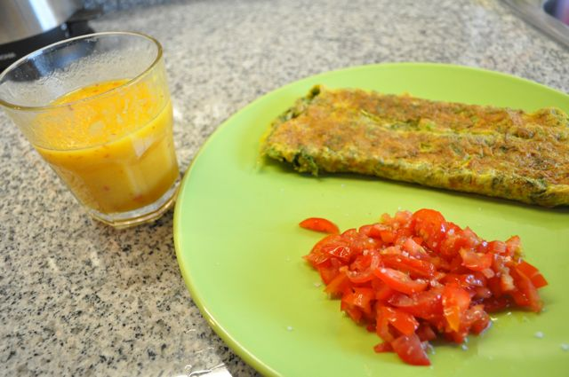
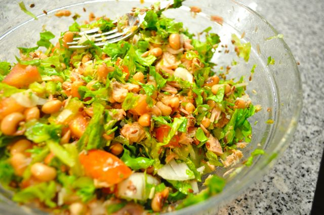

Faz hoje 2 semanas que iniciei a alteração de dieta.

  

Os resultados quantitativos são:

- **Peso**: 84 Kg (menos 1 Kg face à última semana, 3.5 Kg desde o dia 1)
- **Perímetro Abdominal**: 102 cm (o mesmo valor da semana passada, apesar da roupa me parecer mais folgada, é difícil acertar sempre no mesmo sitio para medir a cintura...)

Em termos qualitativos, continuo a sentir-me bastante bem, com energia e habituado à nova dieta. Esta semana foi bastante natural fazer a alimentação de acordo com o meu plano alimentar. Parece-me que é para continuar.

  

De resto, o dia foi, como é normal, bastante ocupado.

  

Em relação à alimentação, correu desta forma:

  

Ao pequeno-almoço, como já se tinha acabado o fiambre, decidi fazer uma omelete com um punhado de ervas aromáticas que tinha em casa (coentros, salsa e hortelã). Para cortar o sabor mais intenso, acompanhei com tomate picado, temperado com sal e um fio de azeite. Para beber fiz um sumo de laranja e pêssego (que partilhei com a Vânia). O tomate fez toda a diferença.

  

  
A meio da manhã algumas amêndoas e uma pêra.  
  
Ao almoço, escalopes de vitela grelhados com legumes estufados (tudo disponível na cantina).  
  
Durante a tarde (das 14:00 às 19:00), algumas amêndoas (ainda que mais do que o normal) e um pouco de chocolate negro 72% cacau.  
  
Quando cheguei a casa, havia muita coisa para fazer, arrumar a cozinha, arrumar o cesto do [Prove](http://www.prove.com.pt/), fazer jantar, etc. Acabei por jantar já depois das 21, tendo preparado a refeição mais rápida que consegui: salada de atum, feijão frade, tomate, cebola e alface, tudo temperado com azeite, vinagre de cidra e oregãos.  
  

  

Para a ceia, ainda não sei, talvez nada... não devo ter fome.
