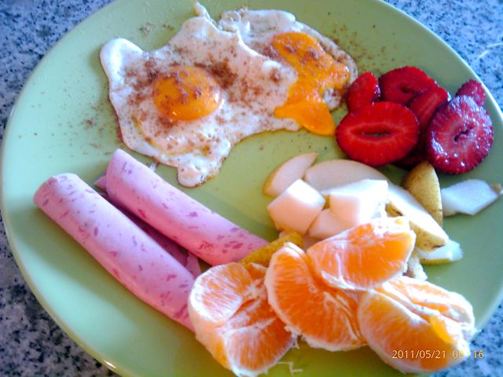
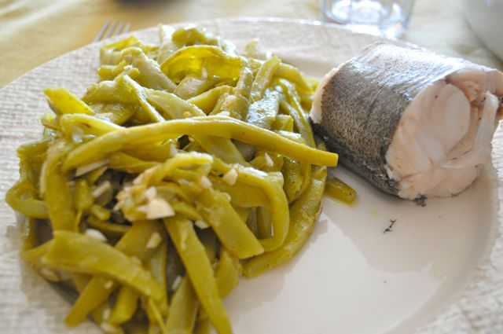
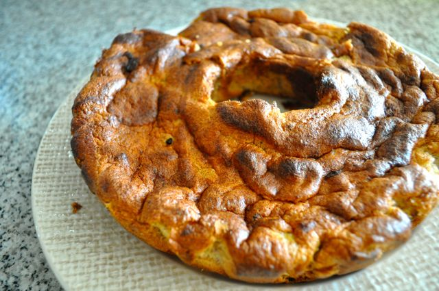

O dia começou bem, mortadela de frango, ovos estrelados com farinha de linhaça, morangos, pêra e laranja.

  

  

A meio da manhã fruta e amêndoas, enquanto tratava da comida na Inês e de uns afazeres caseiros.

  

Fiz mais algumas _crackers_, tendo mudado um pouco a receita, para incluir azeite com malaguetas (ao invés de azeite normal), reduzir a quantidade de sementes de sésamo e adicionar uma colher de chá de mel (das colmeias do meu tio Manel). Ficaram óptimas. Quando se começa a mastigar sente-se o doce ligeiro e o salgado. No fim uma explosão picante devido ao azeite. Devem ficar bastante bem com ovos pela manhã.

  

Para o almoço, pescada cozida com feijão verde temperado com azeite, vinagre de sidra, alhos picados e farinha de linhaça escura (a Vânia não gostou mas para mim estava um autentico pitéu!).

  

  
Hoje fui jantar à casa dos tios da Vânia, pelo que fiz um "Pão de Banana" para sobremesa, receita que retirei do "Paleo Cookbook". Ficou óptimo, pouco doce mas muito saboroso (receita mais em baixo).  
  

  

Para o lanche, amêndoas e alguns morangos.

  

Para o jantar, carne grelhada, fruta e bastante alada (até aqui tudo bem), um copo de vinho tinto. Sobremesa (descambou), 3 fatias pequenas de Pão de Banana, café, um pouco de aguardente (bagaço) e mais tarde um cálice de champanhe.

  

Ceia, passo.

  

  

**Pão de Banana**

1 + 1/2 chávenas de farinha de amêndoa

2 bananas esmagadas

1/4 chávena de mel

1/4 chávena de azeite

1 colher de sopa de canela em pó

3 ovos (gemas separadas das claras)

  

Bater as gemas com o mel até estarem fofas. Juntar a farinha, bananas, azeite e a canela. Misturar muito bem.

Bater as claras em castelo. Envolver ao restante preparado com cuidado para que as claras não percam demasiado ar.

Forrar uma forma com papel vegetal, verter o preparado e levar ao forno a 180º (previamente aquecido), durante 20 a 25 minutos.
