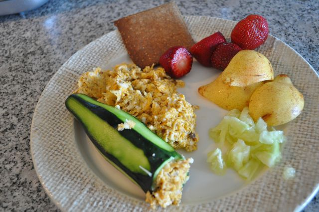
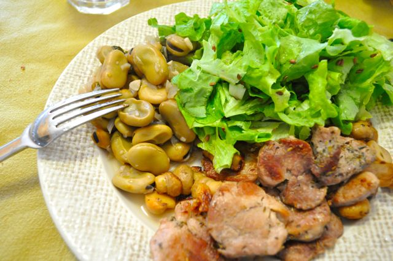
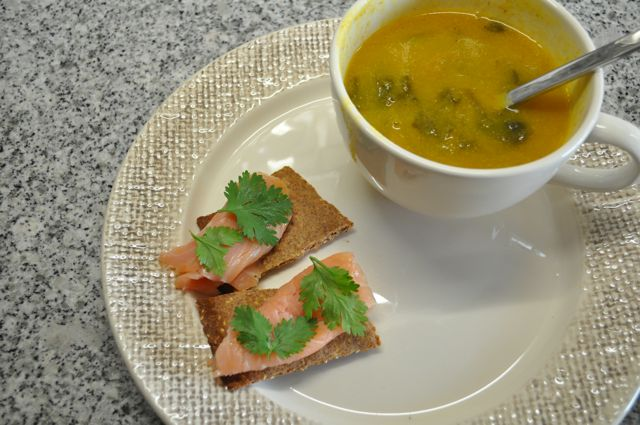

  

Ao pequeno-almoço experimentei fazer uma receita do livro "The Paleo Cookbook", chamada "Sandwich de Pepino". Basicamente consiste num pepino cujo interior foi retirado, recheado de ovo mexido. Acompanhei com uma _cracker_ e fruta. A _sandwich_ não ficou grande coisa.

  

  
A meio da manhã, não comi nada. Estive muito ocupado.  
  
Para o almoço, favas cozidas com alho, cebola e coentros, acompanhadas com lombinhos de porco fritos (previamente temperados com ervas provence e sal) e salada de alface temperada com azeite, vinagre e sementes de linhaça escura.  
  

  
A meio da tarde, enquanto estava no supermercado a fazer compras senti algumas tonturas. Não sei o que se passou. Comprei umas bananas da Madeira e comi duas. Reforcei com um quadrado de chocolate negro 70% cacau _light_. Melhorei. Comi umas amêndoas quando cheguei a casa.  
  
Para o jantar, sopa de nabiça e _crackers_ com salmão fumado e coentros.  
  

  
Para a ceia, gelatina de maçã (finalmente encontrei uma sem açúcar).
