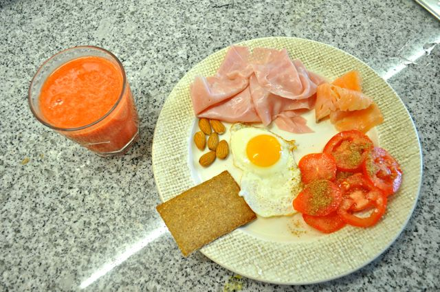
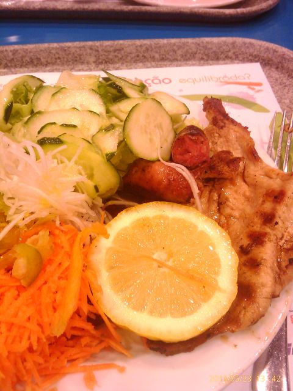
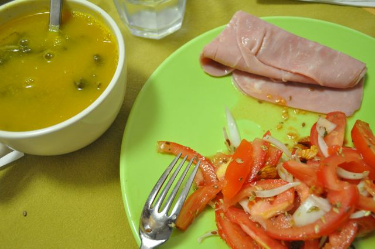

Ao pequeno-almoço, sumo de morango e laranja, cracker, ovo estrelado, amêndoas, fiambre, salmão e um tomate fatiado temperado com azeite e farinha de linhaça escura.

  

  

A meio da manhã, café, fruta e amêndoas.

  

Para o almoço, grelhada mista (salsichas frescas e febras de porco) acompanhada de salada.

  

  

Lanche, fruta e amêndoas.

  

Para o jantar, sopa de nabiças, fiambre e salada de tomate.

  

  

Para a ceia, o resto da gelatina de maçã.
