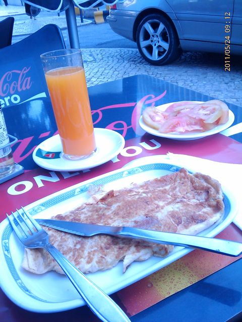
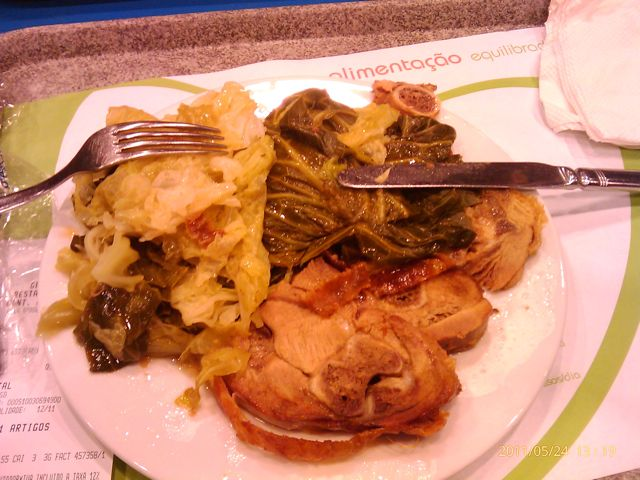

Hoje acordei pelas 5:55, depois despachar as senhoras cá de casa, fui fazer análises em jejum pelo que não tomei pequeno-almoço em casa. No fim, fui a um café perto do trabalho para comer alguma coisa: omelete de fiambre, sumo de laranja natural e uma salada pequena de tomate.

  

  

Hoje não comi a meio da manhã (reunião de 3 horas ...). Só bebi um café.

  

Ao almoço, perna de peru assada no forno com couve cozida, tudo coberto pelo molho do peru. Café.

  

  
Lanche, fruta e amêndoas.  
  
Para o jantar, frango assado com salada e feijão vermelho. Tive convidados para jantar, que trouxeram uma Viennetta. Provei uma fatia com 1 cm. Café.  
  
Para a ceia, talvez gelatina.
