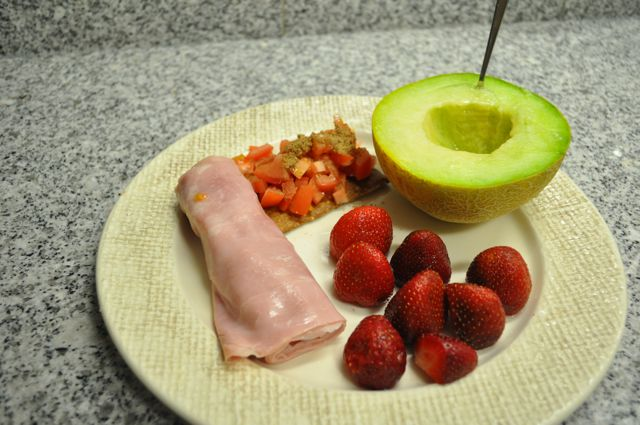
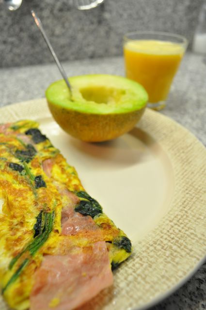
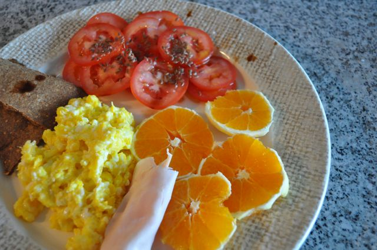
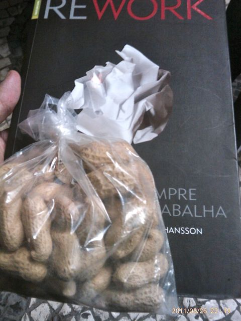
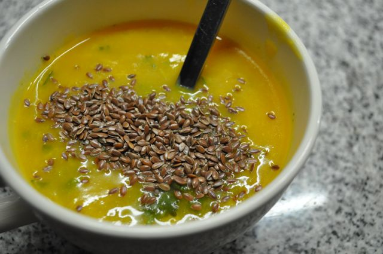

Faz hoje 3 semanas que iniciei a alteração de dieta.

  

Os resultados quantitativos são:

- **Peso**: 83 Kg (menos 1 Kg face à última semana, 4.5 Kg desde o dia 1)
- **Perímetro Abdominal**: 101 cm (menos 1 cm face à última semana)

  
Os último dias foram ocupados, jantar fora de casa, problemas no trabalho, etc. As minhas refeições foram as seguintes.  
  
Pequenos-almoços:  
  

quarta-feira, _cracker_ com tomate picado, fiambre, meloa e morangos.

  

quinta-feira, omelete de fiambre e espinafres, meloa e sumo de laranja com banana

  

hoje, _cracker_, ovos mexidos, tomate com sementes de linhaça, fiambre e laranja.

  
A meio das manhãs, fruta e amêndoas todos os dias.  
  
Ao almoço, sempre carne grelhada ou assada com legumes ou salada. Hoje fui convidado para um almoço (fora da cantina), rodizio (ui ui) onde comi principalmente carne, salada e feijão (preto e frade). Saí um pouco da linha com um punhado de batatas fritas, um rissol pequeno e dois pedacinhos de queijo.  
  
Ao lanche, todos os dias comi fruta e amêndoas.  
  
Ao jantar, na quarta-feira comi na casa da mãe da Vânia. Carne estufada com legumes, salada e ananás natural. Na quinta-feira, cheguei tarde (problemas no trabalho). Comi uns amendoins no barco (entre as 18 e as 22:15 só tinha comido uma maçã) e uma sopa de peixe com linhaça escura, quando cheguei a casa.  
  

  

  

Hoje fui assistir ao [Ignite](http://igniteportugal.clix.pt/2011/05/13-ignite-portugal-lisboa-lxfactory.html) no LxFactory, pelo que jantei por lá. Duas cervejas e um "amburga" do [1300 Taberna](http://www.facebook.com/pages/1300-Taberna/204142182951866) (mais umas facadas na dieta).

  

Quando cheguei a casa, uma colher de sobremesa de sementes de linhaça e 4 morangos.

  

O dia de hoje teve alguns abusos. O fim-de-semana vai ter de seguir direitinho. Faz parte.
