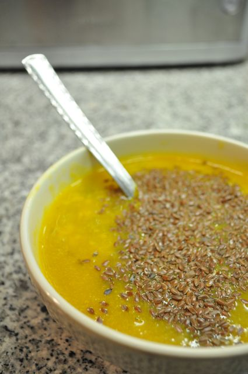

Mais dois dias de alteração de dieta, continua tudo a correr sobre rodas. Não existem sinais de saturação.

  
Os pequenos almoços foram assim:  
  

Sábado, ovos estrelados com linhaça, fiambre de perú, abacaxi e morangos.

  

Hoje, salsichas com linhaça, amêndoas, maçãs e abacaxi.

  

No Sábado fomos almoçar com uns amigos. Foi difícil resistir ao pão com as entradas... mas resisti. Destas comi uma rodela de paio fumado, ovas e salada de polvo. O prato principal foi cabeça de cherne grelhada (que partilhei com dois amigos) acompanhada com feijão verde e cenoura cozidos. Até aqui tudo bem... o que falhou foram os 3 ou 4 copos de vinho branco e dois pedacinhos de sericaia que "roubei" à Vânia.

  

  

Hoje ao almoço comi carne estufada com feijão verde temperado com azeite, vinagre balsâmico e alho picado.

  

  

  

Sábado ao jantar, comi perú e codornizes assadas no forno com salada. Durante o serão (que durou até às 2:00) comi algumas nozes e fruta (cerca de 4 peças). 

  

No Domingo, sopa de peixe (que tinha sobrado da semana...) com sementes de linhaça. Um quadrado de chocolate negro _light_ 70% cacau.

  

