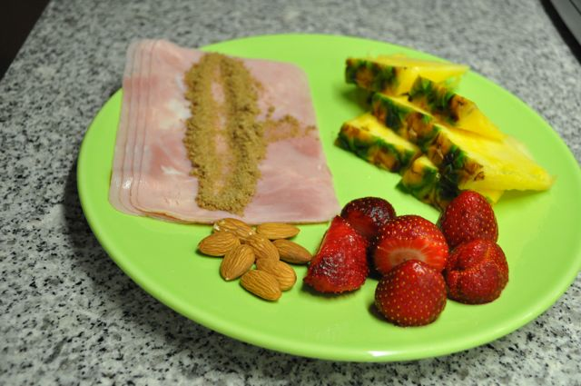
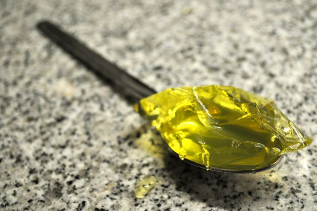
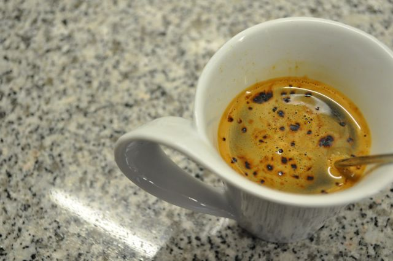
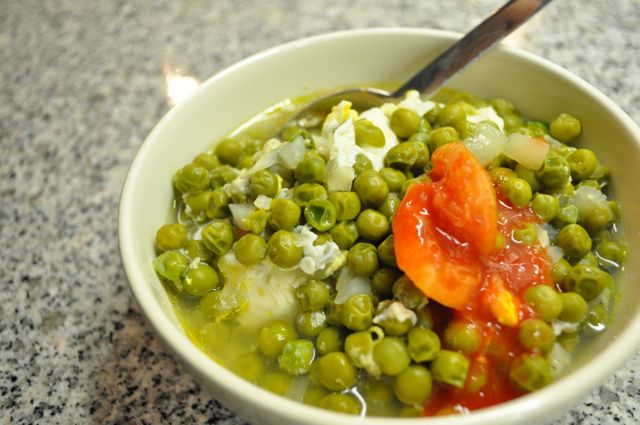

Hoje fui buscar as análises. Da minha perspectiva de leigo parece-me tudo OK.  
  
Pequeno-almoço, fiambre com farinha de linhaça, ananás, morangos e algumas amêndoas. Duas colheres de sopa de gelatina e um café.  
  

  

  

  
Durante a manhã, fruta (uma maçã pequena) e 7 ou 8 amêndoas.  
  
Ao almoço, lombos de garoupa com bacon, cenoura e couves cozidas. Café.  
  
Durante a tarde (das 14:00 às 20:00), umas 15 amêndoas, uma pêra e uma maçã,  
  
Ao jantar, ervilhas com ovos, acompanhadas por uma colher de picante "indiano". Café e um rectângulo de chocolate negro _light_ 70% cacau.  
  

  
Para a ceia, talvez uma colher de sopa de gelatina (sem açúcar).
