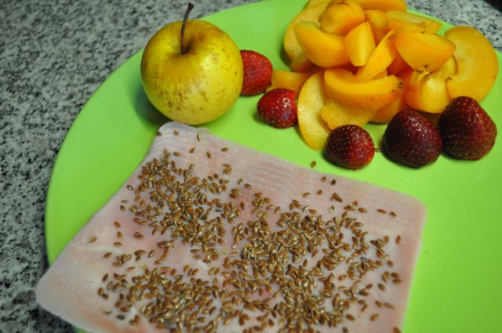
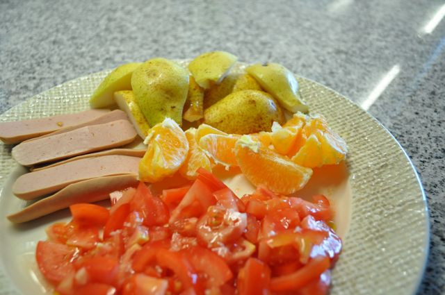
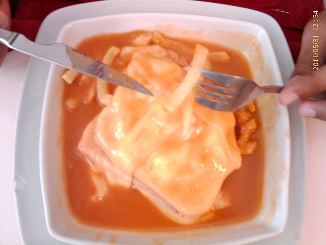
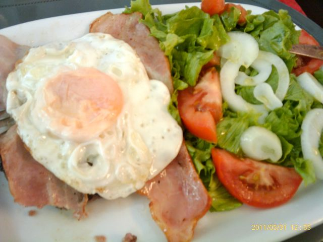
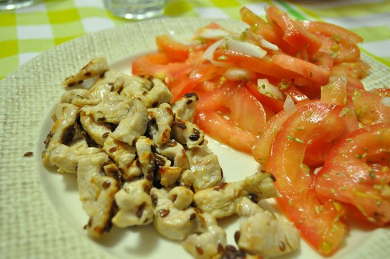
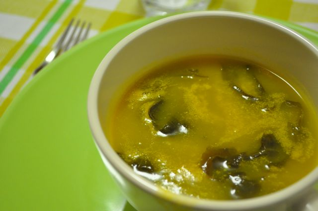
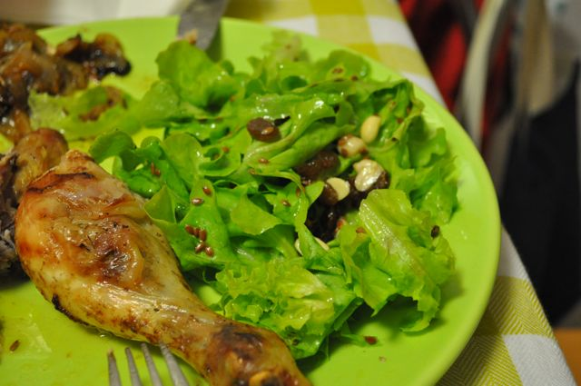

Os últimos dias não têm sido "pêra doce". Problemas, problemas e mais problemas. Chegar tarde a casa.

  

Hoje consegui voltar ao ginásio, fiz o programa CROSS da passadeira, que tem duração de 24 minutos. Se conseguir ir duas vezes por semana já fico contente.

  

Nos últimos dias, os pequenos almoços foram assim:

  

Fiambre, sementes de linhaça, uma maçã pequena, morangos e dois alperces.

  

  
Hoje, salsichas (que não comi todas porque são demasiado fortes para a manhã), tomate, duas pêras pequenas e uma laranja.  
  

  
Os lanches foram basicamente amêndoas e fruta.  
  
Ontem ao almoço, foi a despedida de um colega que vai para França. Fomos ao "Dom Tacho" comer uma Francesinha.  
  

  
Resisti. Provei um triângulo da Francesinha de um colega (estava óptima) e comi 5 (míseras) batatas fritas. Fiquei-me por um hambúrguer "de carne verdadeira, feito aqui, não é como em outros sítios", com bacon, ovo estrelado e salada mista. Pedi mais uma salada de tomate para equilibrar a quantidade de vegetais.  
  

  
Hoje ao almoço comi filetes assados com banana, couve e cenoura cozida. Fiquei com fome. Comi uma gelatina.  
  
Ontem ao jantar, cheguei a casa pelas 20:30, a Vânia estava super cansada e a dormir. Fiz um jantar rápido: tiras de peru fritas num fio de azeite, com sementes de linhaça e sumo de limão, acompanhada por salada de tomate e esparguete integral, este só para a Vânia. Ainda sobrou para o almoço dela. Comi um rectângulo de chocolate negro light 70% cacau.  
  

  

Hoje, sopa de nabiça, perna de frango assada no forno acompanhada de salada de alface, com sementes de linhaça, passas e amendoins, tudo feito pela Vânia.

  

  

  
A ceia/sobremesa nos dois dias foi gelatina sem açúcar.
