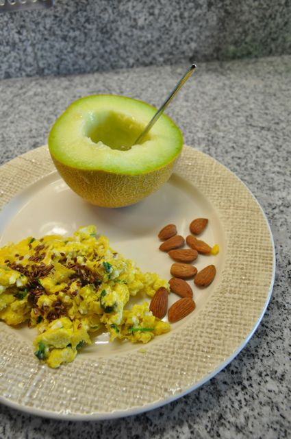
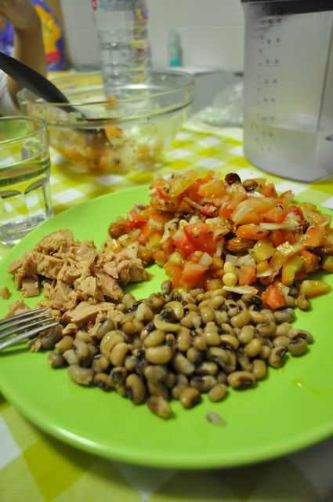

O dia começou agitado. Alteração alimentar na Inês, começou (ou voltou) a beber leite de biberão. Hoje calhou-me a mim a tarefa, que não foi fácil de terminar. Atrasei-me, comi à pressa e saí a correr.  
  
O dia continuou agitado. Trabalho, trabalho e mais trabalho. Saí tarde.  
  
O dia terminou agitado. A Vânia tratou do jantar da Inês, eu tratei do nosso jantar e arrumei a cozinha, que estava de "pantanas".. A Inês deixou-se dormir. Sentei-me no sofá às 22:15... Ufff.  
  
Em relação à dieta, continua tudo a correr bem. As refeições foram assim:  
  
Ovos mexidos "à pressa" com coentros e sementes de linhaça. Meia meloa para acompanhar.  
  

  

A meio da manhã, maçã fatiada e amêndoas.

  

Ao almoço, coelho à caçador com cenouras cozida. Os vegetais hoje não me agradaram e então comi meio prato de cenoura, temperada com o molho do coelho.

  

Tarde, uma maçã e amêndoas.

  

Jantar, atum e feijão frade (a dupla do desenrasca) acompanhados com salada de tomate (picado) com cebola, amêndoas, amendoins, sementes de sésamo, sementes de linhaça e sultanas, tudo temperado com sal, azeite e vinagre de vinho tinto.

  

  

Ceia, vou comer um pouco de gelatina sem açúcar.
