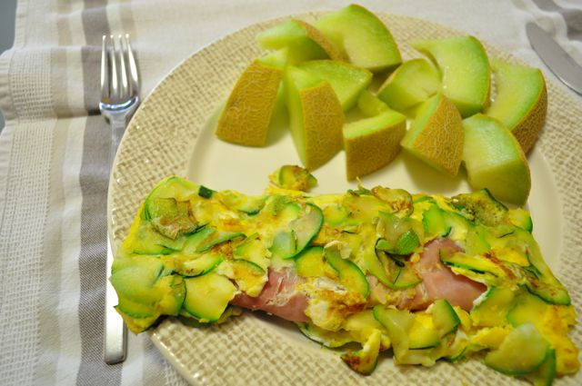
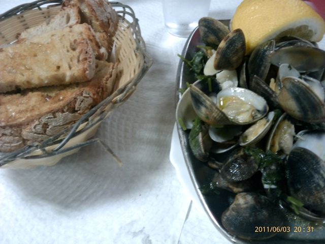
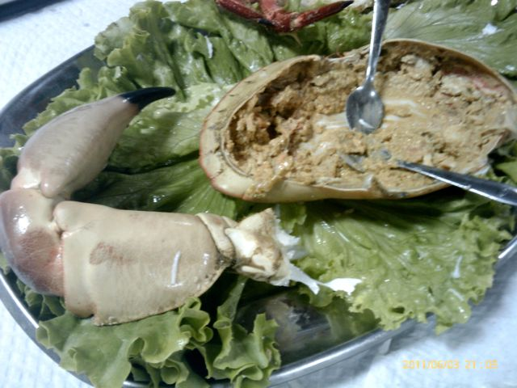
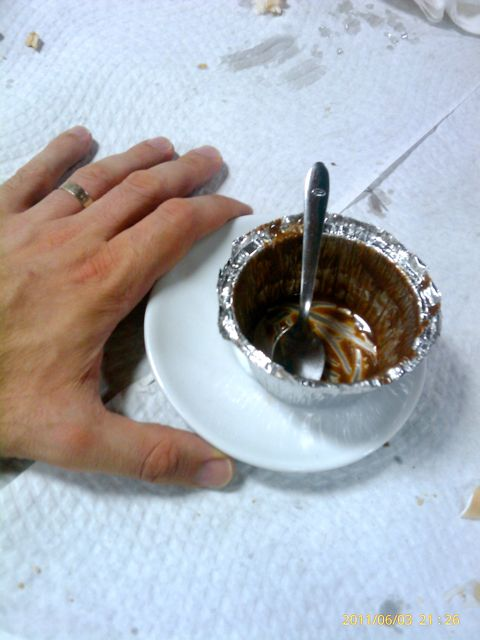

Eu e a Vânia fazemos 5 anos de casados. Consegui sair cedo para ir jantar com a Vânia. A Inês ficou com os meus sogros.

  

Hoje, faz 4 semanas que iniciei a alteração de dieta e é também "dia de pesagem". Os valores quantitativos são:

- **Peso**: 82 Kg (menos 1 Kg face à última semana, 5.5 Kg desde o dia 1)
- **Perímetro Abdominal**: 100 cm (menos 1 cm face à última semana, 2/3 cm desde o dia 1)

De resto, sinto-me bastante bem e continuo com energia.

  

As refeições foram assim:

  

Pequeno-almoço, omelete de courgette e fiambre com meloa.

  

  
A meio da manhã, uma pêra e amêndoas.  
  
Ao almoço, entrecosto grelhado com couve e cenouras cozidas.  
  
Ao lanche, uma pêra e amêndoas.  
  
Ao jantar, foi dia de comemoração (uma mini-pausa na dieta). Fomos jantar à "Antónia" na Moita, que tem principalmente marisco e umas imperiais super frescas e leves (bebem-se que parecem água).  
  
Amêijoas e torradas (que saudades...), com duas imperiais.  
  

  
Sapateira e torradas (que saudades...), com duas imperiais.  
  

  
Sobremesa, uma mini-mousse de chocolate (que miséria de tamanho...) e um café. Um passeio junto ao rio e regresso a casa.  
  

  

Ceia, o pai da Vânia comprou uns bolos... não sei se vou a jogo, acho que já chega por hoje.
