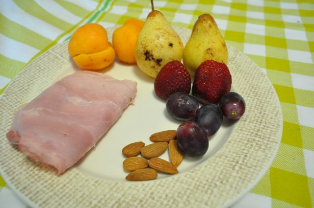
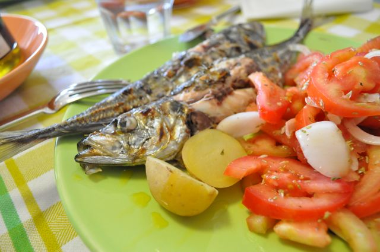
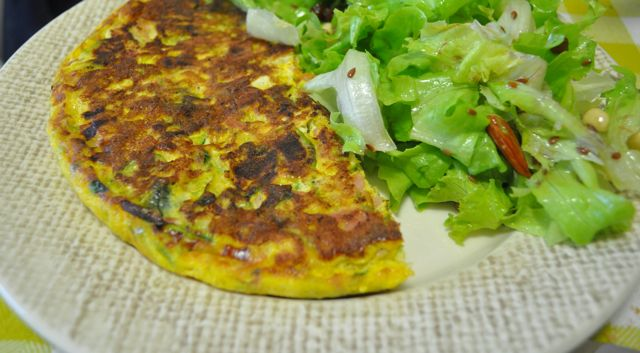

Ontem foi assim:

  

Fiambre, damascos, pêras, morangos, uvas e amêndoas.

  

  
Para o almoço, apeteceu-nos algo com sabor a Verão. Fui à praça com a Inês e comprei carapaus para grelhar em casa. Acompanhámos com salada de tomate e batatas cozidas (eu só comi uma ...).  
  

  
Lanche, fruta e amêndoas.  
  
Jantar, tortilha de courgette, alho francês, fiambre e coentros, acompanhada com salada de alface, amêndoas, amendoins e sementes de linhaça.  
  

  

No Domingo voltei à Arrábida para um passeio de bicicleta todo-terreno. Fizemos 37 Kms. Foi difícil porque há cerca de 1 ano que não andava de bicicleta, mas tirando as dores nas pernas, correu tudo bem.

  

Comecei o pequeno-almoço com fiambre, fruta e amêndoas. Durante a volta de BTT fui comendo amêndoas e passas.  
  
Almocei na casa dos meus pais, perca no forno com feijão verde. Comi cerejas e um pouco de gelatina como sobremesa.  
  
De tarde, estive na feira medieval em Alhos Vedros, onde comi um caldo verde e uma entremeada no pão (esta foi a parte pior). Quando cheguei a casa, depois de tratarmos da Inês, comi uns morangos, amêndoas e um rectângulo de chocolate (estava com alguma fome...).  
  
Ceia... acho que vou cozer um ovo...
