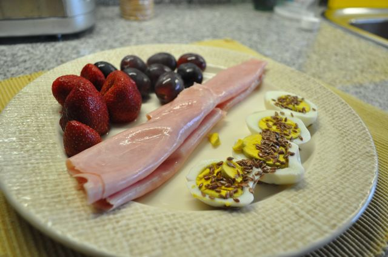
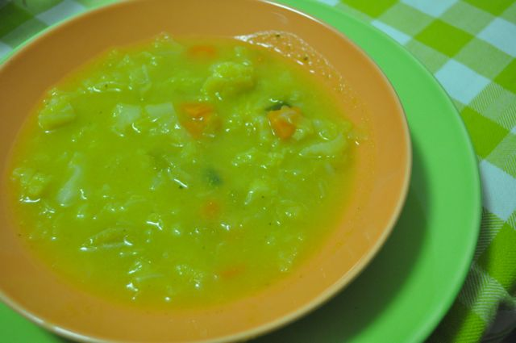
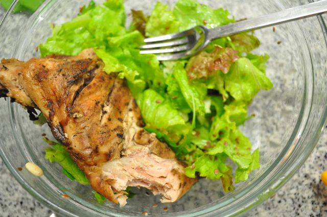

Hoje foi um dia normalíssimo.  
  
Pequeno-almoço, morangos, uvas, fiambre e ovos cozidos com sementes de linhaça.  
  

  

Durante a manhã, uma banana e amêndoas.

  

Ao almoço, bifes de perú grelhados com couve lombardo, brócolos e cenoura cozidos. Café.

  

Durante a tarde, duas pêras e amêndoas.

  

Para jantar, a minha mãe esteve cá em casa e trouxe uma sopa e frango assado, que acompanhámos com salada de alface, rúcula, hortelã, amêndoas, amendoins, passas e sementes de linhaça, tudo temperado com sal, azeite e vinagre. Uma pêra e uma "cevadinha" no final.

  

  

  

Ceia... hoje não há.
