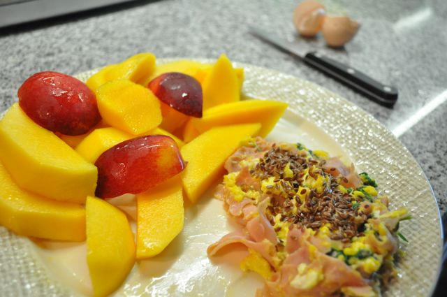
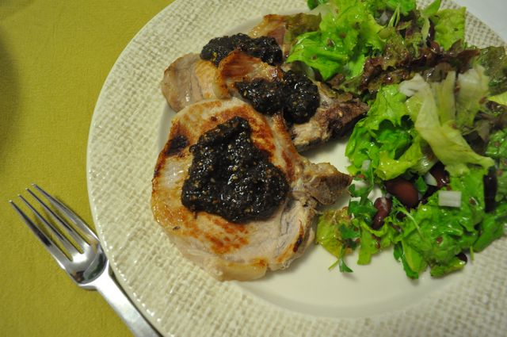

Hoje ao pequeno-almoço comi uma manga, uma nectarina e ovos mexidos com fiambre, coentros e sementes de linhaça.

  

  

A meio da manhã, uma banana e amêndoas.

  

Ao almoço, entremeadas grelhadas com salada de cenoura ralada, tomate e alface.

  

Ao lanche, amêndoas e uma maçã pequena.

  

Hoje fomos vacinar a Inês e eu levei a vacina do tétano. A Vânia tinha deixado umas costeletas de porco a descongelar, que fizemos grelhadas, acompanhadas com salada de alface, rúcula, hortelã, cebola e feijão encarnado. Tentei replicar [este](http://elvirabistrot.blogspot.com/2011/06/costeletas-de-porco-grelhadas-com-molho.html) molho. Coloquei os ingredientes a olho e não juntei à carne (a Vânia não gosta muito de molhos)...  tinha tudo para correr mal e correu...

  

Comi 10gr de chocolate negro 70% cacau light e bebi uma "cevadinha".

  

  
Ceia... acho que vou passar.
