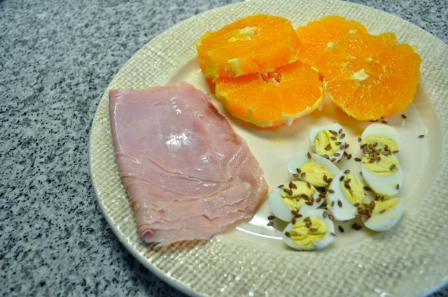
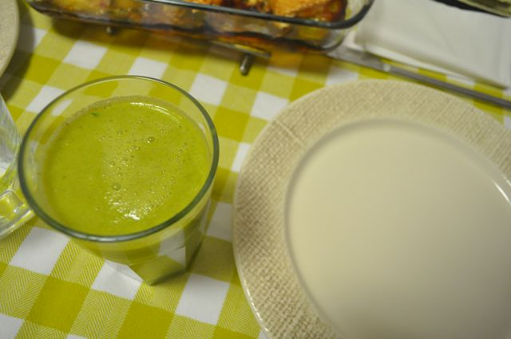
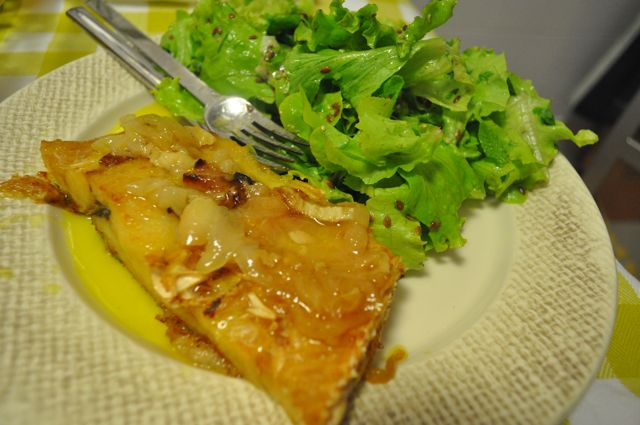
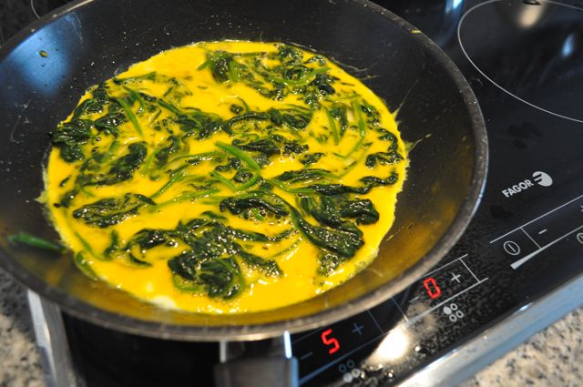
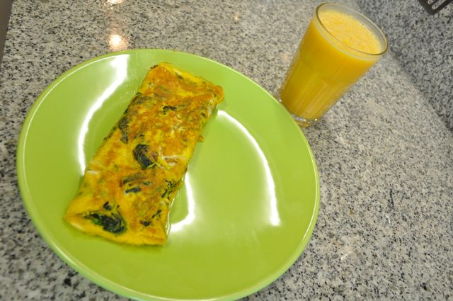
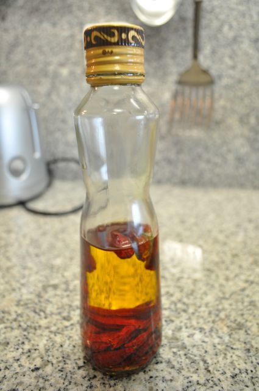
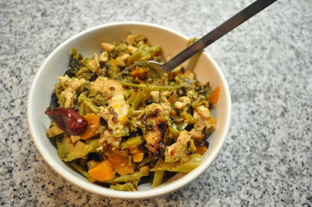

Ontem o dia começou com ovos de codorniz cozidos, sementes de linhaça, fiambre e uma laranja.

  

  

Meio da manhã, amêndoas e fruta.

  

Pelas 12:15 fui 30 minutos ao ginásio (10 minutos de bicicleta, 12 minutos de corrida e 5 minutos de remo).

  

Ao almoço, costeletas de porco (com um molho do qual não me lembro o nome) com couve cozida e cenoura. Fiquei com fome...

  

De tarde, bastantes amêndoas (estava com fome) e fruta.

  

Antes de jantar, fiz um sumo "tipo" gaspacho: na Bimby, refogado com azeite, alhos e coentros, juntei 2 tomates, 1 pepino e meio pimento verde. Tudo bem desfeito. Juntei água fresca. Rectifiquei os temperos com sal e um pouco de vinagre. Bebi dois copos.

  

  
Para jantar propriamente dito, bacalhau assado no forno com azeite e cebola (feito pela Vânia) e uma salada.  

  

Continuei com fome, durante o serão comi 2 nectarinas e cerca de 50gr de chocolate negro 70% cacau _light_.

  

Ontem a Inês teve febre no infantário. Hoje fiquei de prevenção em casa, durante a manhã. Depois de preparar o biberão e lhe dar alimento, fui tomar o pequeno-almoço. Tinha um molho grande de espinafres que salteei num pouco de azeite picante. Juntei os mesmos a 4 ovos e fiz uma omelete. 

  

  

Acompanhei com um sumo de laranja e banana.

  

  

O azeite picante. Feito com azeite "normal" e uma mão-cheia de malaguetas, em repouso durante alguns meses (ao fim de umas semanas já pica mas quando passam uns meses é que fica no ponto).

  

  

Fruta antes de sair de casa.

  

13:00 consulta no Nutricionista. A alteração de dieta está a correr bem. Tenho algumas modificações no plano alimentar (basicamente, vou introduzir outro tipo de sementes, nozes, paio e presunto, a algumas refeições).

  

14:30, almoço: secretos de porco com uma salada de tomate.

  

Durante a tarde, amêndoas.

  

Para o jantar fiz brócolos e cenoura salteados com tiras de bife de perú, com um pouco de molho de soja e sementes de linhaça. Reguei com um pouco de azeite picante. Comi cerca de 20gr de chocolate negro 70% cacau _light_.

  

  

Ceia... talvez coza um ou dois ovos de codorniz.
