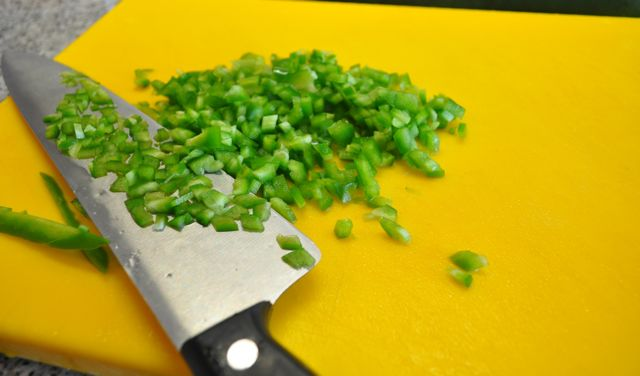
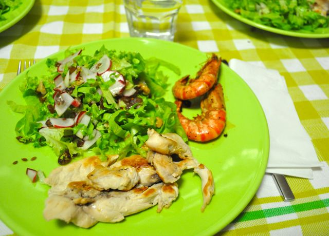

Hoje iniciámos "As Limpezas Grandes", que significam limpeza de tudo e mais alguma coisa cá em casa.  
  
O objectivo de hoje foi retirar tudo dos roupeiros, limpar por dentro, escolher coisas que já não usamos, reorganizar, etc., etc., etc. Felizmente tivemos ajuda.  
  
A Vânia, a mãe e a avó trataram do "trabalho principal". A mim coube-me os trabalhos mais secundários: a copa, o berçário e o _stock,_ ou seja, tratar das refeições, da Inês e das compras. O meu sogro fez de _baby-sister_ da Inês enquanto eu tratava dos outros dois assuntos.  
  
As refeições foram assim:  
  
Pequeno-almoço, fruta, aveia, sementes de linhaça e fiambre.  
  
Durante a manhã, nozes e fruta.  
  
Para o almoço fiz uma sopa de beldroegas (receita no fim do _post_) e uma uma salada fria de atum, feijão frade, tomate, pimento e pepino. Temperei com vinagre, azeite, oregãos, sal e sementes de linhaça (com a confusão de preparar a mesa, a Inês com sono, esqueci-me de tirar mais fotografias... dá para ver apenas o tamanho dos cubos do pimento...). Terminei com um kiwi, uma fatia de meloa e o resto do puré de manga que a Inês não quis comer. Café.  

  

  
Durante a tarde tive bastante fome. Comi fruta, nozes, uma fatia de paio york e duas fatias de presunto.  
  
Para o jantar, bifes de peito de frango grelhados, camarões fritos ao alho e uma salada de alface com rabanetes, passas, nozes e sementes de linhaça. Uma fatia de meloa. Café e 20gr de chocolate.  
  

  
No final da noite ainda fomos a uma pequena festa (um casal amigo inaugurou a casa onde vão viver), onde "petisquei" cerejas, quatro rodelas de chouriço, 1/2 fatia de torta de coco, 1/2 fatia de tarde amêndoa. Acompanhei com um copo de vinho rosé. Foi o deslize da semana.  
  
Ceia... acho que não vai haver.  
  
**Sopa de Beldroegas**  
1 molho de beldroegas , 3 cenouras, 1 alho francês, 1 cebola, 3 dentes de alho, 1 _courgette,_ sal, água, azeite  
  
Descascar e cortar todos os ingredientes (excepto as beldroegas) e levar a cozer numa panela com a água e o sal. Passar até obter um creme. Provar e rectificar o sal se necessário. Enquanto os legumes cozem, preparar as beldroegas, separando as folhas dos caules. Juntar as folhas das beldroegas ao creme e deixar cozer (aproximadamente durante 15 minutos). Adicionar um fio de azeite no final.
