No sábado o pequeno-almoço foi presunto, ovos de codorniz estrelados com sementes de linhaça, uma banana da Madeira (compre o que é nosso!!) e um pêssego.

  

[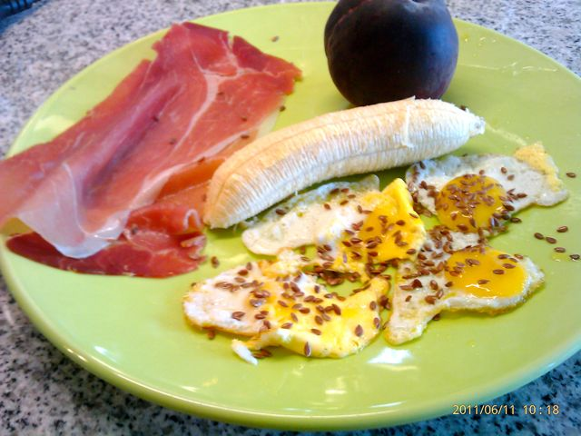](http://1.bp.blogspot.com/-Pu2zFl-RPxw/TfU8E9GGugI/AAAAAAAAEL0/JhjyFhD62yM/s1600/Querida+Di+-+319.jpg)

  
Não comi nada durante a manhã. O almoço foi carapaus grelhados com salada e uma batata pequena cozida com a pele.  
  

[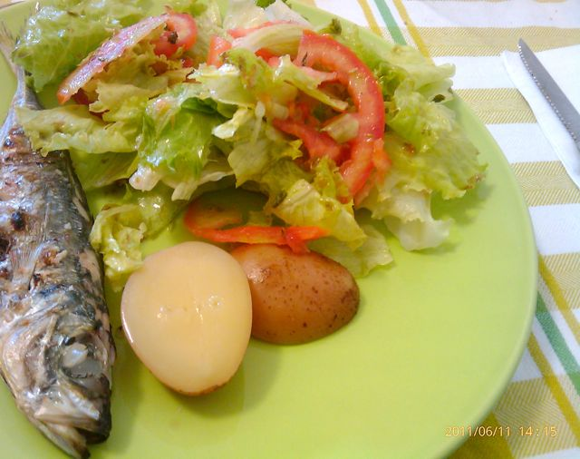](http://4.bp.blogspot.com/-bC0uhEa-NL8/TfU8FUfQoZI/AAAAAAAAEL4/9gMW3erVnPg/s1600/Querida+Di+-+320.jpg)

  

Ao lanche, fruta, uma cenoura crua com presunto e duas fatias de paio york.

  

[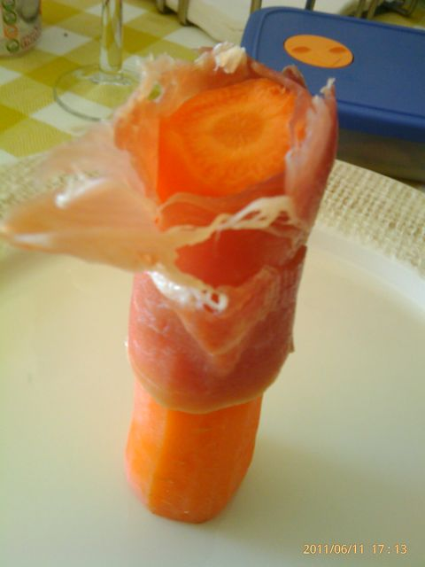](http://2.bp.blogspot.com/-RGHaz41VV4g/TfU8FwOx5II/AAAAAAAAEL8/7CgkdBXGNAI/s1600/Querida+Di+-+321.jpg)

  

Jantámos na casa dos tios da Vânia. Entrada, amêijoas vietnamitas ao alho e coentros, com um copo de vinho rosé.

  

[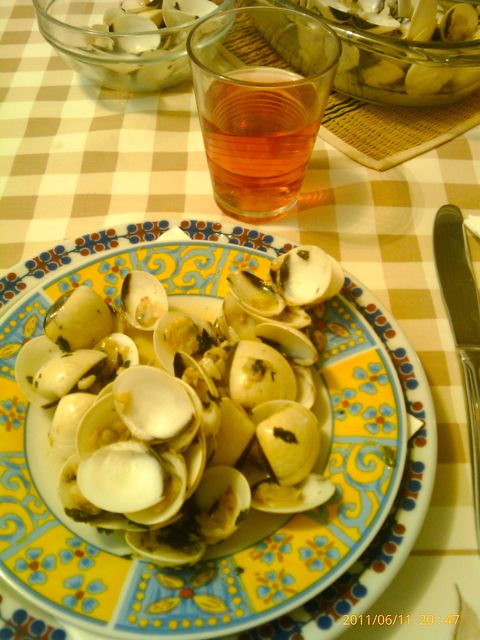](http://2.bp.blogspot.com/-ZImNJrK32xc/TfU8GN27wOI/AAAAAAAAEMA/1WTZmK7ITqw/s1600/Querida+Di+-+322.jpg)

  
O prato principal foi perca assada no forno com salada e três pedacinhos de batata. Molhei um pedaço de pão do tamanho de uma moeda de 2 EUR no molho do peixe.  
  

[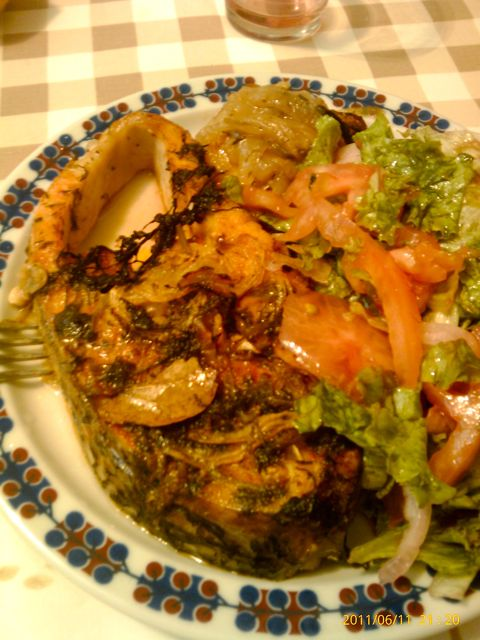](http://4.bp.blogspot.com/-jygR5KqYwTE/TfU8GkS4rtI/AAAAAAAAEME/d_AOjlBIEDE/s1600/Querida+Di+-+323.jpg)

  

Sobremesa, morangos e cerejas.

  

[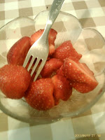](http://1.bp.blogspot.com/-QKUTCuU1-ls/TfU8HCBKEyI/AAAAAAAAEMI/1pmNkxidj-0/s1600/Querida+Di+-+325.jpg)[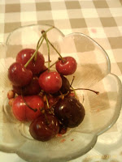](http://1.bp.blogspot.com/-ZcgTxUMQqkI/TfU8Hv7cdBI/AAAAAAAAEMM/TnR9eH3vqdI/s1600/Querida+Di+-+326.jpg)

Hoje (domingo), fui andar de bicicleta para a Arrábida. Deixei-me dormir e acordei 5 minutos antes da hora de saída. Comi à pressa umas fatias de presunto e paio york e uma banana. Levei uma banana e passas para a volta, que foi de 35 Kms. Correu bem apesar de ter chegado estafado à casa dos meus pais para almoçar.  

  

Cheguei cheio de fome, pelo que comi um punhado de cerejas quando cheguei. O almoço foi espetadas de porco e frango assados, acompanhado de salada (e uma misera batata frita...).

  

[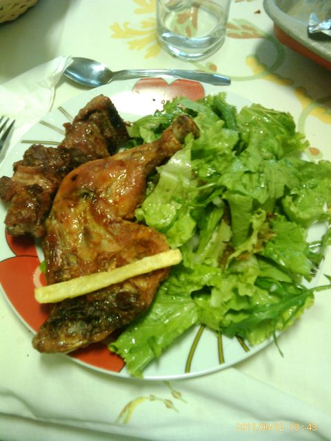](http://1.bp.blogspot.com/-NW-1k2AWOMU/TfU8IvonyOI/AAAAAAAAEMU/1pL3dg4Zm2U/s1600/Querida+Di+-+328.jpg)

  

Sobremesa, o resto de puré de manga que a Inês não comeu, gelatina e cerejas.

  

[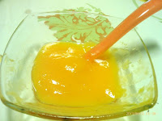](http://2.bp.blogspot.com/-sHsiv58Zh4o/TfU8JClstuI/AAAAAAAAEMY/PSTWMJKWaXs/s1600/Querida+Di+-+329.jpg)[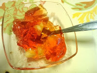](http://4.bp.blogspot.com/-sf822-xplDg/TfU8JqG4nfI/AAAAAAAAEMc/BBM6-oxn8g8/s1600/Querida+Di+-+330.jpg)

  

[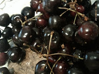](http://4.bp.blogspot.com/-yOti1_gve3o/TfU8KHO7guI/AAAAAAAAEMg/JPyb-zDymFQ/s1600/Querida+Di+-+331.jpg)

  

Durante a tarde estive na casa dos meus sogros. Estava fora do meu "território" e não tinha fiambre, amêndoas ou nozes. Tive alguma fome e comi fruta e umas nozes que a mãe da Vânia tinha (deu para me orientar...). O lanche foi caracóis (comi um pedaço de pão do tamanho de uma moeda de 2 EUR com manteiga...). O jantar foi carne grelhada com salada mista e pepino. Sobremesa, fruta.

  

[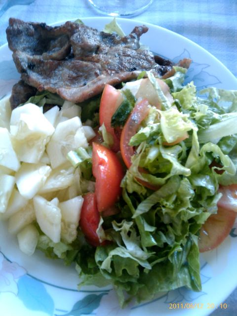](http://3.bp.blogspot.com/-9XXFVED83nI/TfU8KZWfY2I/AAAAAAAAEMk/-ZF78Gzm_Yw/s1600/Querida+Di+-+332.jpg)

  

Depois de tratar da Inês, comi 25gr de chocolate negro 70% cacau _light_.

  

Hoje estive insaciável, comi sempre fruta após as refeições (em quantidades consideráveis...), quantidades pequenas de batatas como acompanhamento e algum chocolate negro. Amanhã tenho de ser mais rigoroso.

  

Ceia, ainda devo comer uma fatia de presunto ou paio york.
