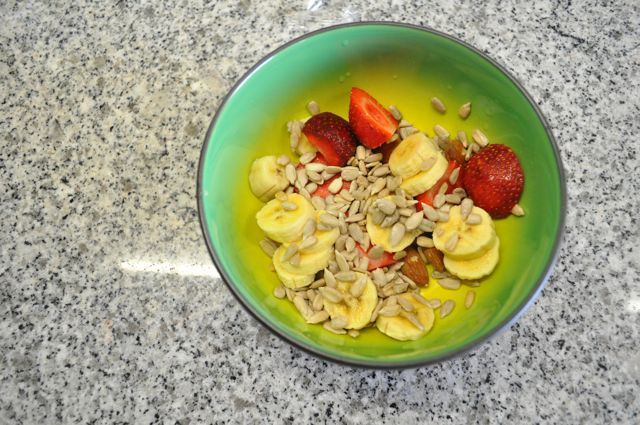
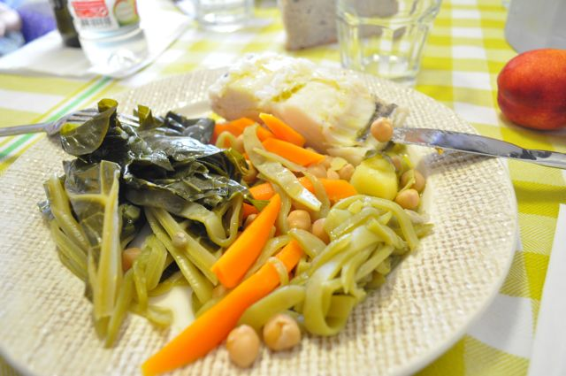
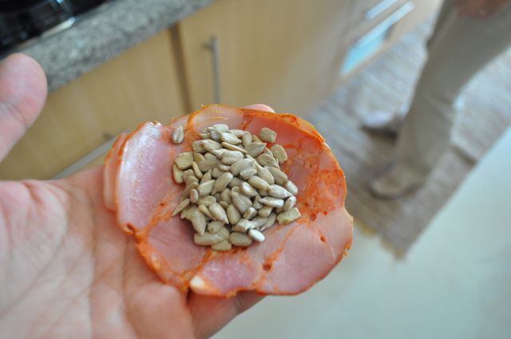
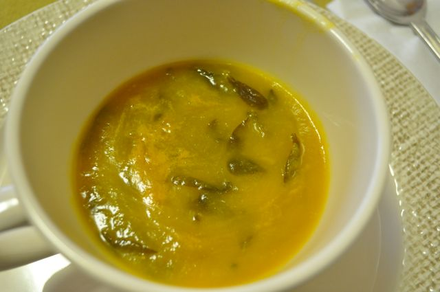
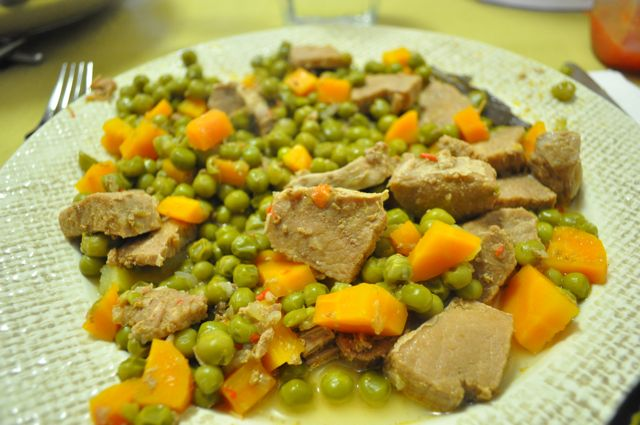

Hoje portei-me bem. Sem deslizes em relação ao Plano.  
  
Ao pequeno-almoço, morangos, uma banana, sementes de abóbora, sementes de linhaça, aveia e amêndoas. Duas ou três fatias de presunto.  
  

  
Durante a manhã comi amêndoas e sementes de abóbora e uma fatia de meloa (e uma "meia fatia" feita em sumo que a Inês não comeu...).  
  
O almoço foi bacalhau cozido com couve, feijão verde, cenoura e um punhado de grão.  
  

  

Ao lanche, antes de sairmos para passear com a Inês no parque comi duas porções de sementes de girassol enroladas em fatias de paio york.

  

  

Quando chegámos a casa, mais um punhado de sementes de girassol.

  
Hoje tratou a Vânia do jantar enquanto eu tratei e entreti a Inês.  
  
A sopa de beldroegas que sobrou de sexta-feira foi a entrada.  
  

  

O prato principal foi carne de vaca guisada com ervilhas e cenouras (eu retirei as batatas do meu prato). A Vânia tem uma receita muito fácil deste prato, que deixo mais em baixo.

  

  

Comi um pouco de chocolate negro 70% cacau light como sobremesa.

  

Ceia, uma fatia de presunto e duas de fiambre.

  

  
**Guisado Simples "À Pressão" (**com uma sopa de entrada dá para 4 pessoas em dieta)  
600 gr de carne de vaca para guisar, cortada em pedaços  
400 gr de ervilhas congeladas  
2 cenouras  
4 batatas médias  
1/4 pimento verde às tiras  
1/4 pimento vermelho às tiras  
1 cebola picada  
1 dente de alho  
colorau q.b.  
sal q.b.  
água q.b.  
  
Colocar todos os ingredientes numa panela de pressão, com excepção das ervilhas, cenouras e batatas. Levar ao lume e deixar cozinhar durante 10 a 15 minuto com pressão. Adicionar as ervilhas, cenouras e batatas, rectificar os temperos, levar ao lume até ganhar pressão e deixar cozer durante mais 5 minutos.
