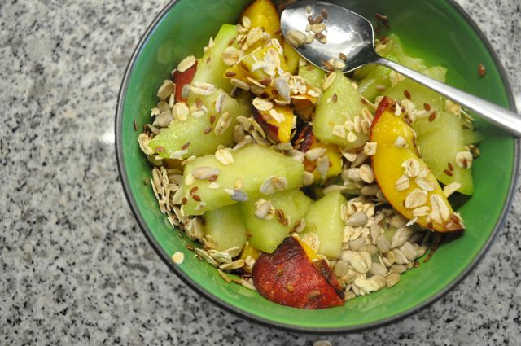
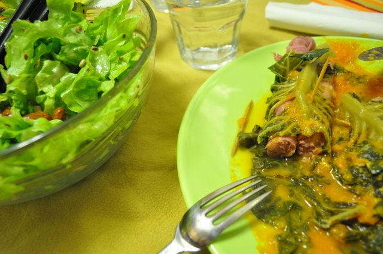
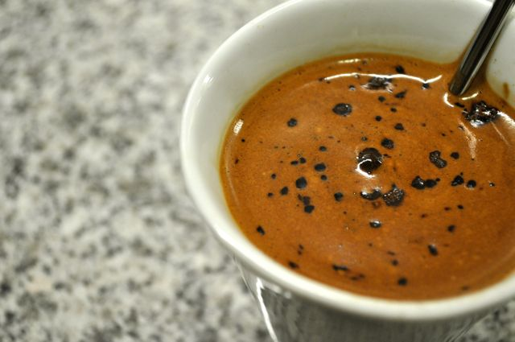

Estes quatro dias já souberam a férias, apesar dos trabalhos de limpeza cá em casa.  
  
O dia de regresso ao trabalho foi assim:  
  
Pequeno-almoço, uma fatia de meloa, um pêssego em gomos, sementes de linhaça e de girassol, aveia e algumas fatias de fiambre.  
  

  
Durante a manhã, as habituais amêndoas e uma maçã.  
  
Ao almoço, carne de vaca estufada com couves e cenouras. Café.  
  
Durante a tarde, as habituais amêndoas e um pêssego.  
  
Quando cheguei a casa, a Vânia tinha feito salsichas enroladas em couve (a [receita](http://www.forumbimby.com/receita.php?recid=65&catid=) do livro da Bimby, mas sem bacon e piri-piri). Fiz uma salada de alface com amêndoas e sementes de linhaça e girassol para acompanhar.  
  

  
Bebi um café instantâneo com um pouco de cevada (para fazer mais creme), sem adicionar açúcar.  
  

  
Fiz uma gelatina que só deve estar pronta amanhã. Ceia, umas fatias de fiambre.
