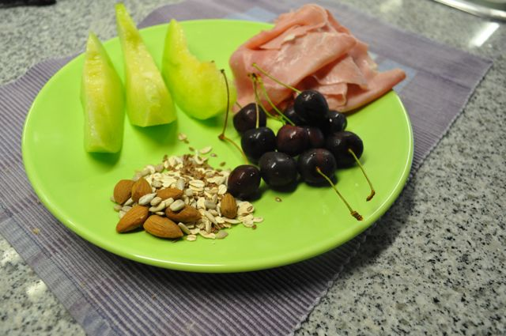
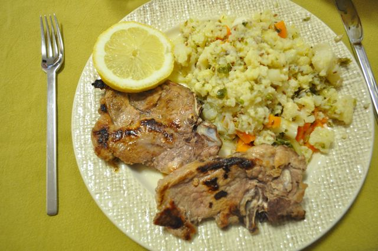
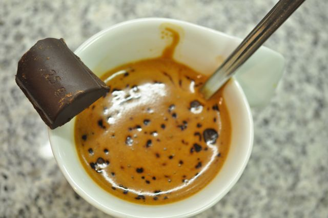

Hoje o dia no trabalho foi complicado... andei feito bombeiro a correr para várias frentes. 

  

O pequeno-almoço foi meloa, cerejas, oito fatias de fiambre e uma mistura de amêndoas, aveia, sementes de linhaça e de girassol. Terminei com uma mistura de café solúvel e cevada.

  

  

A meio da manhã, uma nectaria e amêndoas.

  

Ao almoço, grelhada mista de salsichas frescas e "[fêveras](http://www.priberam.pt/dlpo/default.aspx?pal=f%C3%AAvera)" com couves e cenoura cozidos.

  

Ao lanche comi cerejas e amêndoas. Acusei algum desgaste e tive mais fome do que o normal no fim do dia. Só me apetecia uma das sandes de pão caseiro que há nas máquinas de comida no escritório... Resisti e optei por uma maçã.

  

Quando saí (quase às 20:00...) ainda passei por uma mercearia e comprei algumas cerejas para o caminho.

  

Para o jantar, a Vânia grelhou costeletas de porco (num grelhador de fogão) e cozeu couve-flor e cenouras. Quando cheguei a casa, cortei os vegetais em pedaços pequenos (usando uma tesoura de cozinha), juntei sementes de linhaça e girassol e temperei com oregãos, azeite picante e vinagre. Estava tudo óptimo (repeti a dose de vegetais que aparecem na fotografia em baixo).

  

  
Depois de jantar, [9 gramas](https://lh6.googleusercontent.com/-4YsJ3IkLuWE/TfkgpKzIXBI/AAAAAAAAENk/wHtwGzk1JJg/s800/Cozinha%252520de%252520Caverna%252520-%2525201077.jpg) de chocolate negro 70% cacau _light_ e um café instantâneo com cevada.  
  

  
Ceia, gelatina de morango _light_.
