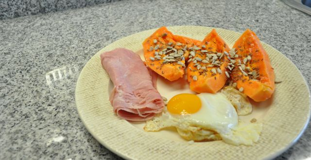
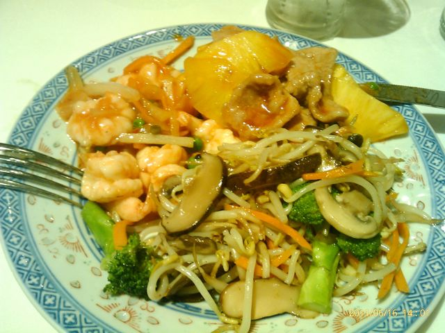
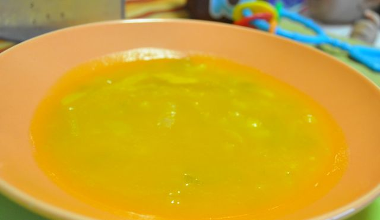
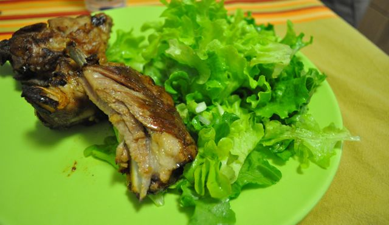

Hoje o dia começou com um pequeno-almoço bastante agradável: papaia bem madura com sementes de linhaça e girassol (o que dá uma sensação diferente a comer pois é possível sentir partes estaladiças, misturadas com o macio e o doce da fruta), fiambre de porco e dois ovos estrelados.

  

  

Durante a manhã comi amêndoas, sementes de girassol e duas nectarinas.

  

Hoje não almocei na cantina (tinha uns assuntos a resolver) e fui com um colega a um restaurante chinês.  Do menu, o melhor que conseguimos foi gambas picantes, porco com ananás natural e um combinado de legumes salteados (rebentos de soja, cenoura, brócolos e cogumelos). O porco e as gambas tinham um molho que pareciam não ter farinha mas pelo sabor adocicado devia ter açúcar (ops...). Mau mau foi a banana frita. Tirei a maior parte da massa que envolve a banana mas mesmo assim... enfim... um dia não são dias...

  

  
Durante a tarde, amêndoas, sementes de girassol, cerejas e uma maçã.  
  
Ao jantar, tivemos uma amiga connosco, que trouxe uma broa de milho fantástica (tive de provar uma côdea...).  
  
Comemos uma sopa de alho francês de entrada.  
  

  
 O prato principal foi entrecosto assado no forno (receita em baixo) com salada.  
  

  
De sobremesa comi algumas cerejas. Café solúvel.  
  
Hoje não há ceia. Abusei durante o dia, o fim-de-semana vai ter que ser mais ligeiro...  
  
**Entrecosto Assado no Forno**  
Receita da minha mãe, bastante simples e saborosa. Da receita "original" só não coloquei leite no final. Para três pessoas.  
  
1500 gr de entrecosto para assar no forno, 200 ml de vinho branco, 4 dentes de alho, azeite q.b., sal e pimenta q.b.  
  
Pré-aquecer o forno a 180ºC. Temperar o entrecosto com sal e pimenta e colocar num tabuleiro para ir ao forno. Cortar os alhos às lascas e colocar por cima do entrecosto. Regar com azeite. Adicionar o vinho branco até cobrir metade da altura do entrecosto. Levar ao forno aproximadamente durante 90 minutos. A meio, rodar virar o entrecosto para tostar dos dois lados.
