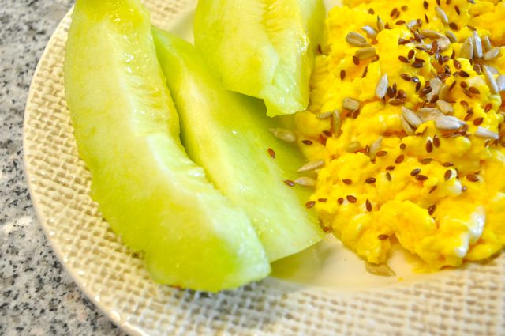
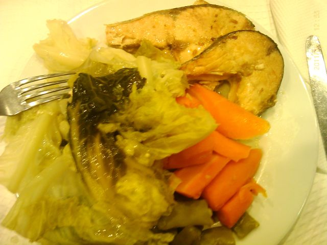
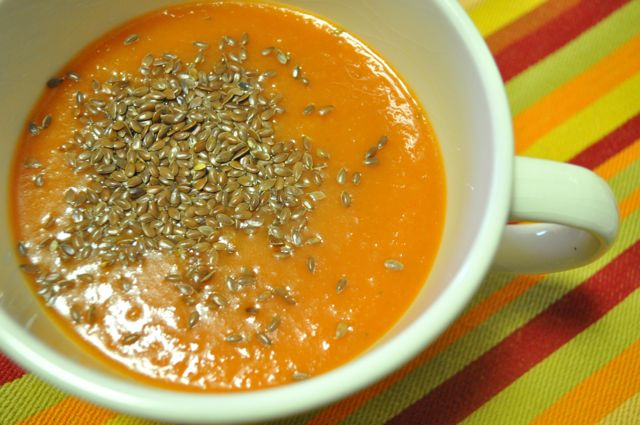
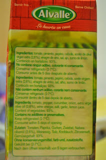
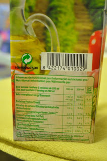
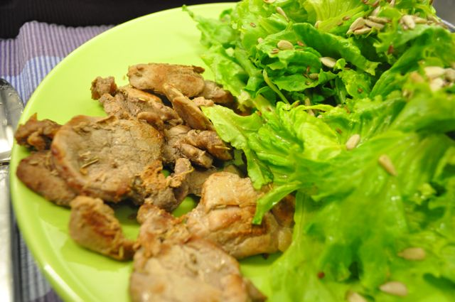

Hoje, faz 6 semanas que iniciei a alteração de dieta e é também "dia de pesagem". Os valores quantitativos são:

- **Peso**: 81 Kg (menos 1 Kg, 6.5 Kg desde o dia 1)
- **Perímetro Abdominal**: 98,5 cm (menos 1,5 cm face à última semana, 4 cm desde o dia 1)

  

Nas últimas duas semanas a redução de peso não foi tão acentuada como anteriormente, em que perdi cerca de 1 Kg por semana. Todavia, roupa continua a ficar-me mais folgada e já estou completamente habituado à alteração alimentar. O que tem corrido menos bem é o facto de pelo menos uma vez por semana fugir um pouco ao plano alimentar (por exemplo, com a ida de ontem a um restaurante chinês). 

  

Em termos de refeições o dia foi assim:

  

Pequeno-almoço, ovos mexidos acompanhado por umas fatias de meloa e sementes de girassol e linhaça. Li esta semana num _blog_ que juntar um pouco de água aos ovos antes de mexer que eles ficam mais fofos. Experimentei e funcionou. A três ovos adicionei duas colheres de sopa de água.

  

  

Durante a manhã, sementes de girassol, amêndoas e duas ameixas pequenas.

  

Ao almoço, salmão grelhado com couve e cenoura cozidos.

  

  

Durante a tarde, mais amêndoas, sementes de girassol e ameixas.

  

Quando sai, passei pelo supermercado e encontrei (finalmente) o gaspacho Alvalle, que me tinha sido recomendado para comer antes do jantar. Comprei duas embalagens, bebi um pouco até chegar a casa, quando cheguei repeti, acompanhado com sementes de linhaça.

  

  

Tenho a dizer que o gaspacho é fantástico. Sabe muito bem e, a julgar pelos ingredientes, é bastante saudável. Recomendo vivamente.

  

  

Ao jantar, fiz lombinhos de porco temperados com canela e alecrim, salteados num fio de azeite. Acompanhei com uma salada de alface com sementes de linhaça e girassol. Fiquei com um pouco de fome. Enquanto arrumava a cozinha comi duas fatias pequenas de meloa.

  

  

A ceia foi gelatina _light_ e um café solúvel com cevada.
