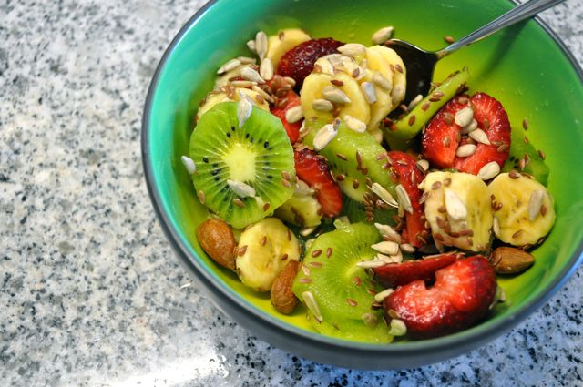
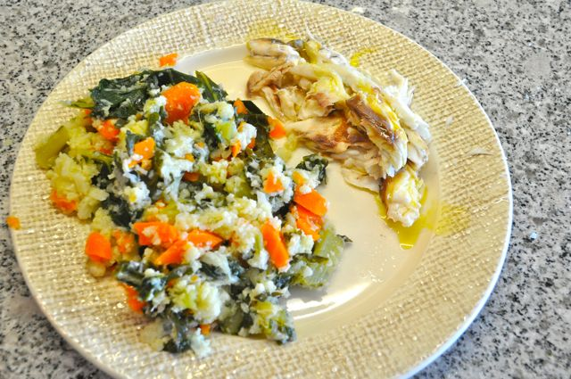
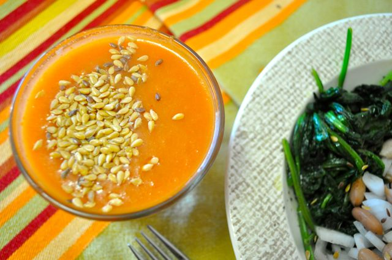
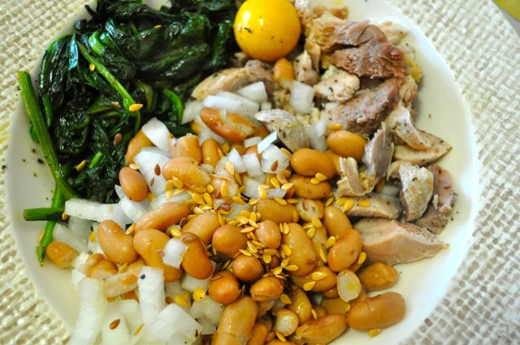

Hoje comecei o dia com fruta, sementes e fiambre.

  

  

Durante a manhã, enquanto tratava de alguns afazeres domésticos, fiz umas crackers de sementes de girassol.

  

<iframe allowfullscreen frameborder="0" height="390" src="http://www.youtube.com/embed/o0_AuRQjn7w?hd=1" width="640"></iframe>

  

Para o almoço, "roupa-nova" de couve portuguesa, cenoura e couve-flôr, que acompanharam uma dourada assada ao sal.

  

  
Durante a tarde comi sementes de girassol, fruta e fiambre.  
  
Hoje a Inês participou num evento de ginástica, organizado pelo infantário. Tivemos de jantar à pressa para não chegarmos atrasados. A Vânia queria canja de arroz, alimento proibido para mim, o que me levou a improvisar um jantar expresso com o que havia em casa.  
  
De entrada bebi um copo de gaspacho com sementes de linhaça.  
  

  
O prato principal foi carne da canja, espinafres salteados, feijão, cebola e sementes de linhaça, tudo temperado com azeite, vinagre e pimenta preta.  
  

  
Ceia, fiambre e gelatina _light_.
