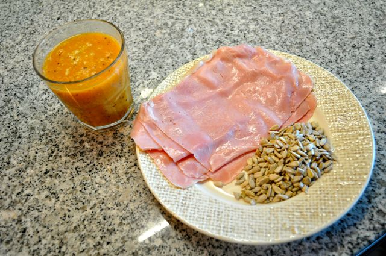
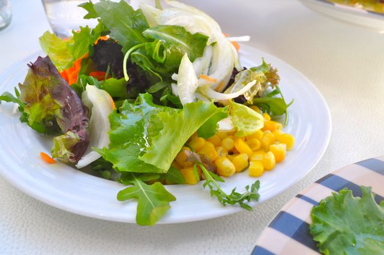
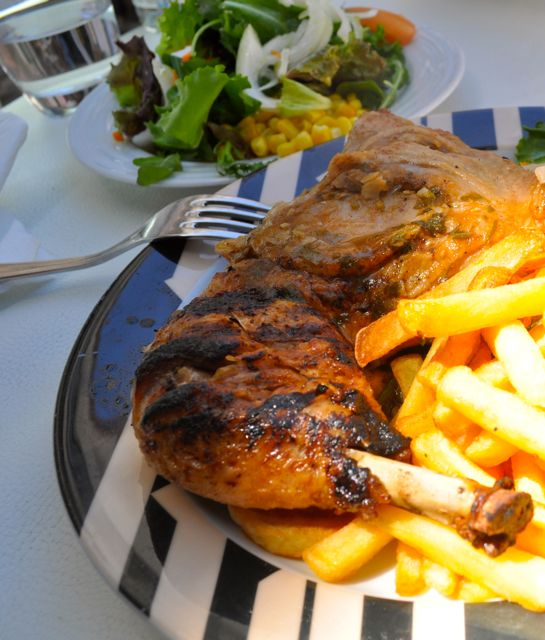
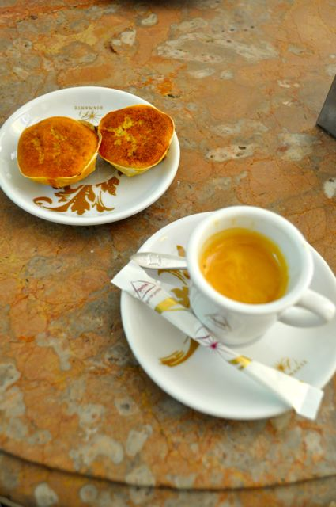
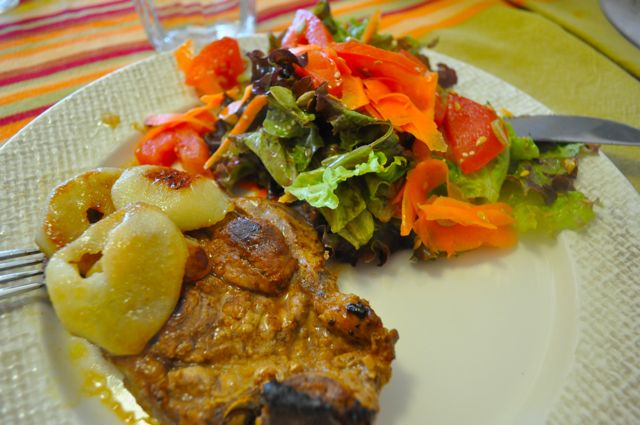

Hoje foi um dia...  
  
Fomos a Sintra ver um [concerto para bebés](http://www.concertosparabebes.com/) (recomendo vivamente). Saímos de casa muito cedo e tive pouco tempo para preparar um "pequeno-almoço de Domingo". Fiz um sumo de laranja, kiwi e morangos, para acompanhar fiambre e sementes de girassol.  
  

  
O concerto terminou pelas 11:00, a Inês comeu a sopa e a fruta e nós fomos à procura de almoço.  
  
(Aconselho a não ler a parte que se segue...)  
  
O almoço... salada... frango assado... batatas fritas... um pãozinho... anánas natural... .  
  

  

  
Bebemos café na Piriquita, acompanhado de duas queijadas de Sintra mornas (estavam uma pequena maravilha...).  
  

  

(Pode voltar a ler...)

  

Durante a tarde, uma nectaria, duas ameixas pequenas e uma _cracker_ de girassol (ver a receita no _post_ anterior).

  

Para jantar, costeletas de porco com pêra grelhada (na frigideira) e uma salada de tomate, alface, cenoura, sementes de sésamo, girassol e linhaça.

  

  

Ceia, gelatina de morango _light_.
