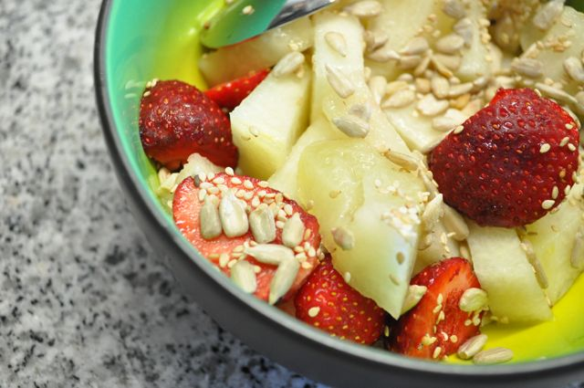
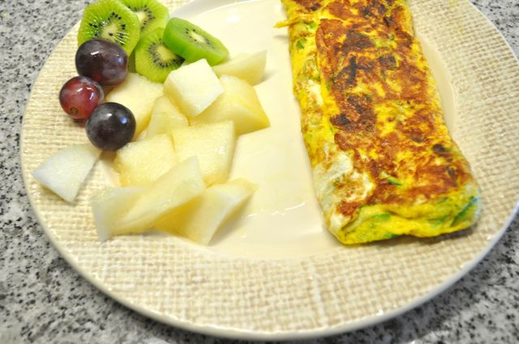
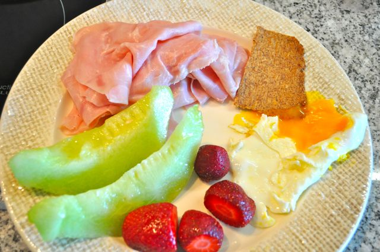
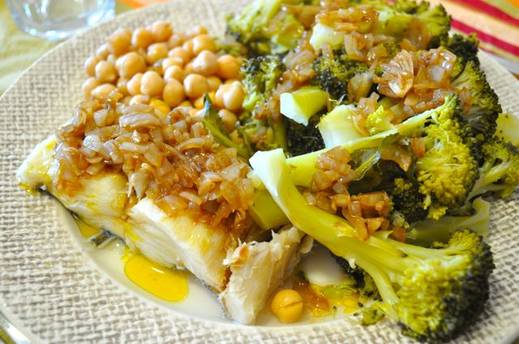
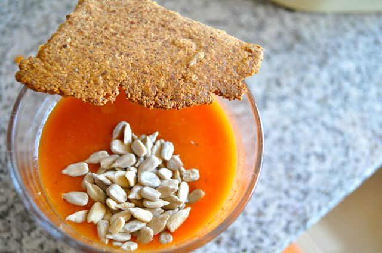
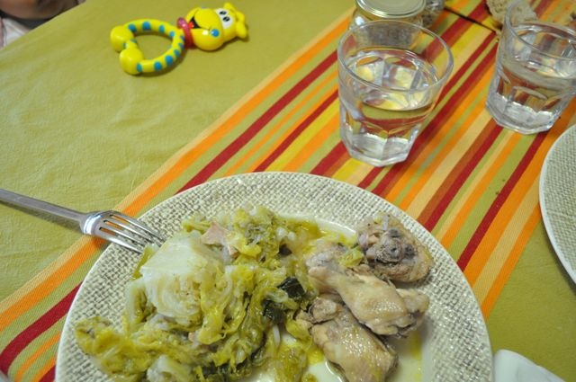
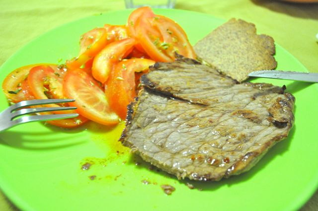
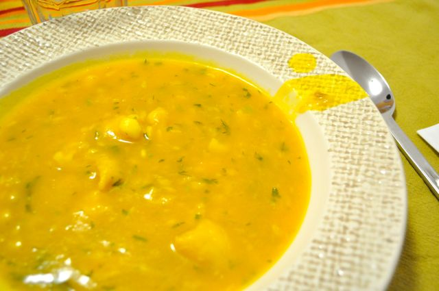

Esta semana foi complicada (e ainda não acabou). Vou estar de férias, muitas coisas no trabalho para terminar e as limpezas grandes em casa ainda por concluir.  
  
Hoje foi dia de pesagem:  

- Peso: 80.5 Kg (menos 0.5 Kg, 7 Kg desde o dia 1) 
- Perímetro Abdominal: 98,5 cm (igual face à última semana, 4 cm desde o dia 1) 

  
Tenho andado com pouco tempo para cozinhar mas a dieta mantém-se relativamente na linha. Apesar dos afazeres consegui registar algumas das refeições.  
  
**Pequenos-almoços**  
Meloa e morangos com sementes de sésamo, sementes de girassol e fiambre.  
  

  

Omelete de courgette com meloa, uvas e kiwi.  

  

Ovo estrelado, fiambre, cracker de sésamo (ver receita aqui), meloa e morangos.

  
**Almoços**  
Bacalhau cozido com grão e brócolos ao vapor. Temperado com cebola confitada em azeite com vinagre balsâmico.  
****  
  
**Lanches**  
Comi bastante vezes gaspacho Alvalle com sementes de sésamo ou girassol, por vezes acompanhado de uma cracker de girassol.  

  
**Jantares**  

Couve coração e frango estufado com ginja (invenção da Vânia).

  

  
Bife do pojadouro com salada de tomate e cracker.  

  

  

Sopa de peixe "à moda da Vânia" (uma receita super fácil e saborosa que um dia hei-de "postar").
