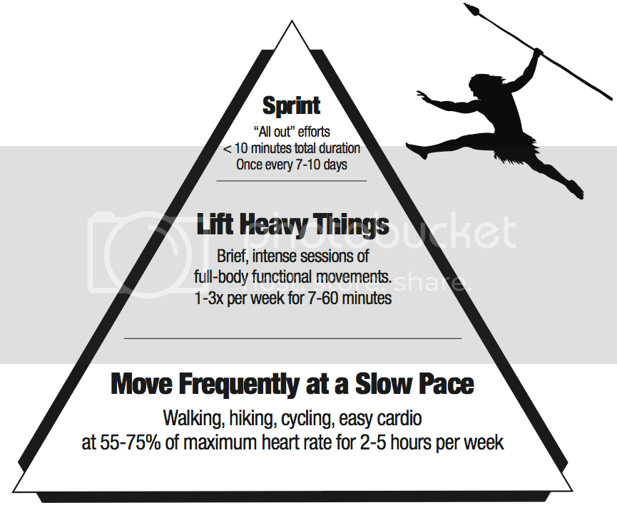

Finalmente de férias (limpezas feitas!!!). Vão ser três semanas em que vou ter tempo para descansar, aproveitar a praia, desfrutar da família e descobrir novas receitas que se encaixem na dieta de caçador-recolector (nas últimas semanas descobri alguns livros de receitas que não tive tempo de explorar devidamente).  

  

Consegui entretanto convencer a Vânia a modificar a sua dieta, no sentido de introduzir o mesmo tipo de alterações que eu fiz há 7 semanas atrás:

- Evitar leite e derivados
- Evitar alimentos demasiado processados
- Evitar arroz, batata e massa
- Eliminar o açúcar
- Eliminar fontes de glúten

Esta alteração facilita a preparação das refeições porque passa a ser igual para os dois. Por outro lado vai trazer alguns desafios porque a Vânia é um pouco mais exigente do que eu (que como qualquer coisa...).

  

Vou também aproveitar as férias para testar um modelo distinto de exercício físico, o [Primal Blueprint Fitness (PBF), do Mark Sisson](http://www.marksdailyapple.com/primal-blueprint-fitness/) (livro disponível para _download_, sem custos), que tem as seguintes características:

- Pouco exigente em termos de tempo, oferecendo atalhos que maximizam os resultados, sem dor, sofrimento ou sacrifício.
- Serve para qualquer pessoa, independentemente do nível de forma física, idade ou experiência.
- Requer nenhum ou muito pouco equipamento.
- É para a vida.

Concretamente, consiste em:

- _Sprintar_ uma vez por semana
- Levantar coisas pesadas duas a três vezes por semana (ou seja, flexões, elevações, pranchas, agachamentos, etc.)
- Movimentação frequente a baixo ritmo, duas a cinco horas por semana

  

  

Fonte: [http://www.marksdailyapple.com](http://www.marksdailyapple.com/)

  

O PBF tem uma auto-avaliação que vou fazer amanhã para saber qual é o nível de exercícios em que devo começar.

  

Uma vez atingidos os 50 dias de dieta, vou alterar o formato dos _posts_, passando apenas a colocar receitas e relatórios de progresso. A razão principal prende-se com o facto de achar que os _posts_ já anteriores são suficientes para ilustrar como é que alguém pode introduzir uma dieta deste tipo no seu dia-a-dia, não trazendo grande valor continuar a colocar neste _blog_ o mesmo tipo de informação. Assim, vou focar-me em arranjar novas receitas que utilizem principalmente ingredientes comuns (que existam em qualquer super-mercado) e que possam ser feitas com facilidade e em pouco tempo. 

  

Ahhhh, vivam as férias!!!
