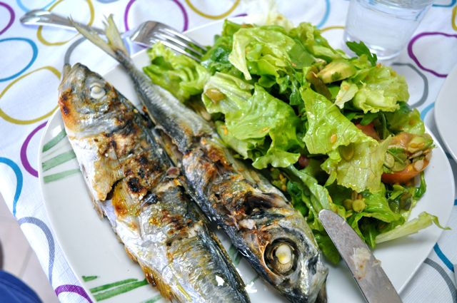

Fiz esta salada nos últimos dias para acompanhar douradas escaladas, carapaus e grelhadas de carne mistas. Fácil, rápida e saborosa.  
  

  
  
**Ingredientes (para 2 pessoas)**  
8 folhas de alface, 2 tomates médios, 1 mão cheia de rúcula, 8 pés de coentros, 1/2 pêra abacate, 1/2 pimento assado, 1 c. sopa de sementes de linhaça, 1 c. sopa de ementes de abóbora, 1 c. sopa de sementes de girassol, azeite q.b., vinagre q.b., sal q.b.  
  
**Preparação**  
Ripar a alface, cortar os tomates em fatias, picar os coentros, cortar a pêra abacate em cubos, juntar todos os ingredientes e temperar com azeite, vinagre e sal.
