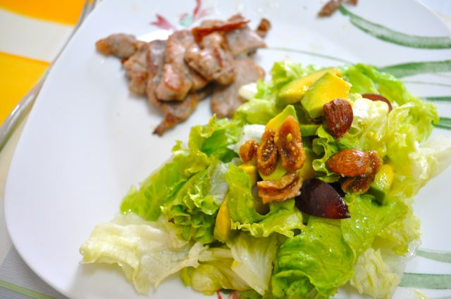

Hoje queríamos jantar cedo para darmos uma volta com a Inês depois de jantar. Enquanto a Vânia lhe deu a sopa fiz uns lombinhos com uma salada (foi meio inventada com os ingredientes que tínhamos, mas até ficou boa).

  

  
**Ingredientes (para 2 pessoas)**  
_Lombinhos_  
300 gr de lombinhos de porco, sumo de 1 limão, azeite q.b., vinagre q.b., sal q.b.  
_Salada_  
10 folhas de alface, 1 pêra abacate madura, 4 figos secos, 10 uvas, 10 amêndoas, azeite q.b., vinagre q.b., sal q.b.  
  
**Preparação**  
_Lombinhos_  
Cortar os lombinhos em fatias e temperar com sal. Aquecer uma colher de sopa de azeite numa frigideira. Saltear as fatias de lombinhos no azeite. No fim regar com sumo de limão.  
_Salada_  
Lavar e ripar a alface. Cortar a pêra abacate em pedaços pequenos. Com uma tesoura de cozinha cortar os figos em fatias pequenas. Cortar as uvas em quartos. Juntar todos os ingredientes e temperar com sal, azeite e vinagre.
