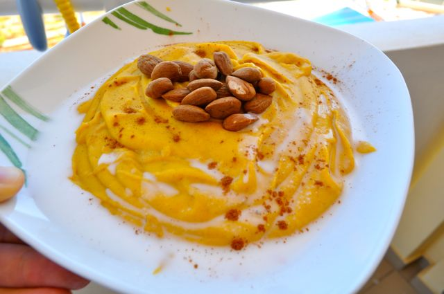
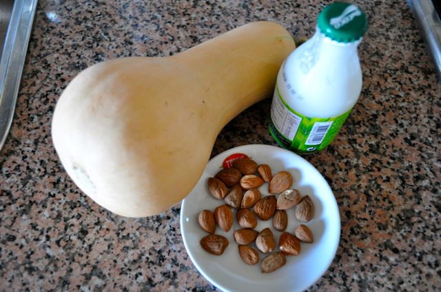
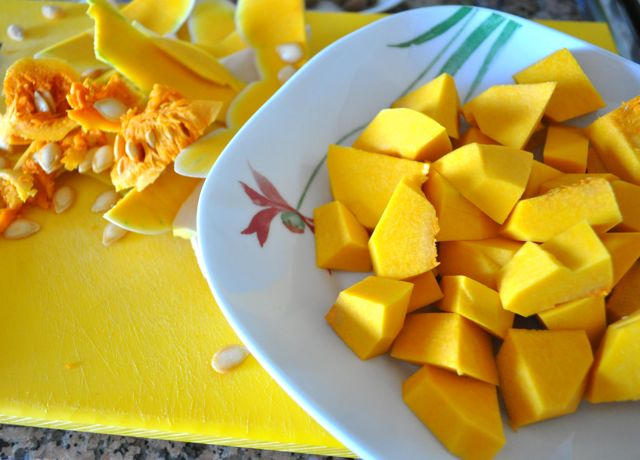

Uma das minhas dificuldades na alteração de dieta está relacionada com o pequeno-almoço. Tirando as omeletes, ovos estrelados ou mexidos, fiambre, fruta, frutos secos, etc., não tenho arranjado grandes alternativas.  
  
O livro [Primal Blueprint Quick and Easy Meals](http://www.amazon.com/Primal-Blueprint-Quick-Easy-Meals/dp/0982207743), do Mark Sisson, tem uma receita para um pequeno-almoço à base de abóbora, leite de côco e canela, que resolvi testar hoje para averiguar se pode ser uma alternativa viável.  
  
Não ficou mau. Se fosse um pouco mais doce tinha ficado melhor (talvez juntando uma colher de mel). A Vânia não quis provar...  
  
  
  
  
**Ingredientes (para 2 pessoas)**  
1/2 abóbora manteiga, 1 + 1/2 chávena de leite de côco (eu só tinha uma garrafa com 200 ml, foi o que usei), 1 c. sopa de canela, 1 punhado de amêndoas (ou nozes)  
  
**Preparação**  
Descascar a abóbora, retirar as sementes e cortar em cubos pequenos. Colocar no micro-ondas na temperatura máxima durante 8 minutos (ou até a abóbora ficar macia). Triturar a abóbora com uma varinha mágica (ou na Bimby). Juntar a canela e o leite de côco e envolver bem. Servir com as amêndoas e um pouco de leite de côco.  
  

  

