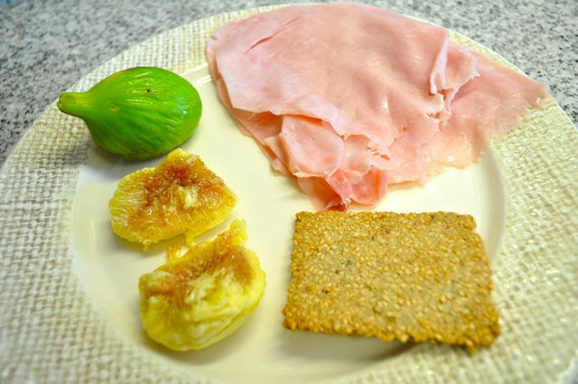
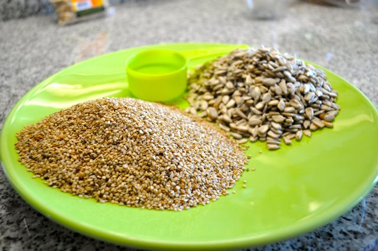
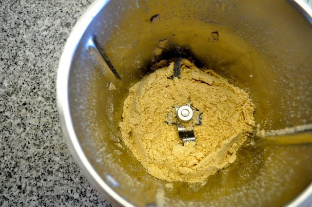
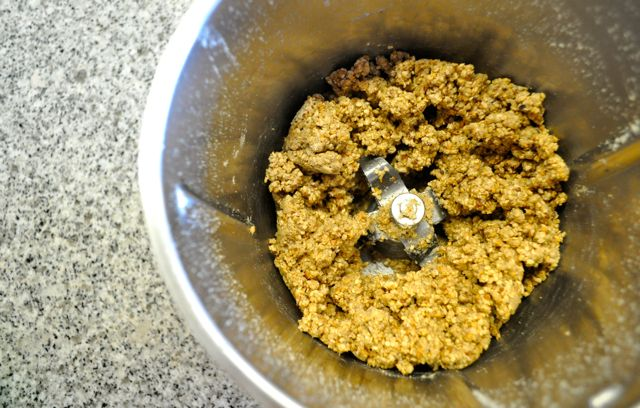
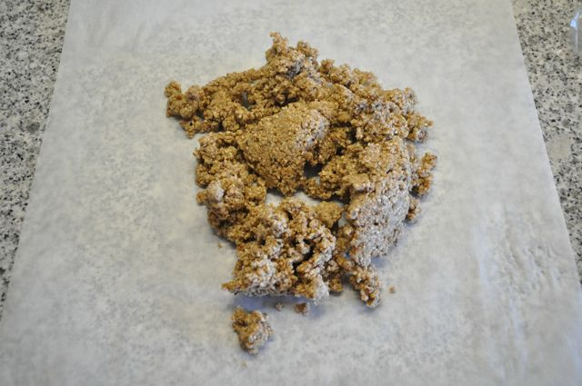
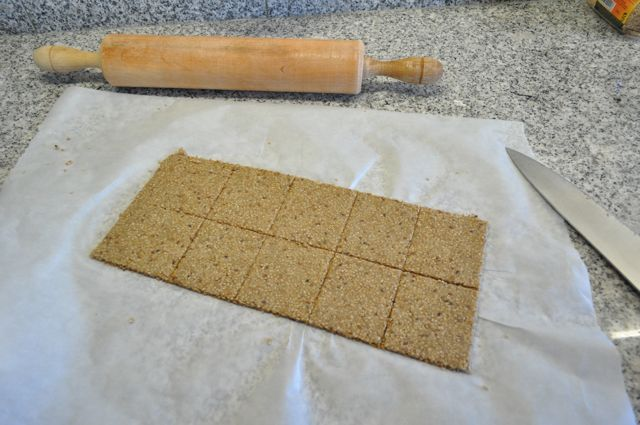
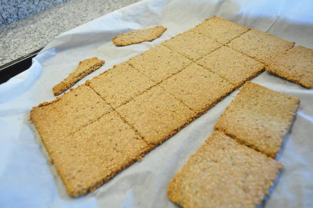
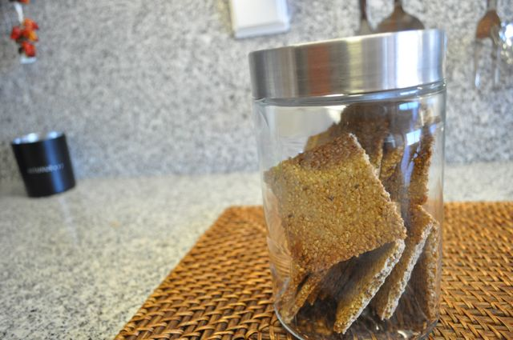

Isto não tem andado fácil. O regresso das férias (isto é, coisas para arrumar e roupa para lavar) e a Inês outra vez doente não me têm deixado dedicar a coisas novas (nem a nada...).

  

No global as férias foram boas (apesar do choque da primeira vez depois da Inês nascer). Em termos da alteração de dieta consegui cumprir perfeitamente (tirando uma mariscada e um jantar num restaurante Italiano...). Comecei a fazer exercício de acordo com o Primal Blueprint Fitness (a seu tempo darei mais detalhes).

  

Após 11 semanas de alteração de dieta o progresso continua a ser bastante positivo. Tenho neste momento 78 kg, menos 9.5 kg que no inicio.

  

Hoje experimentei uma receita de crackers de sementes de girassol e sésamo. Descobri a mesma no _blog_ Mark's Daily Apple ([aqui](http://www.marksdailyapple.com/sunflower-sesame-crackers-with-shrimp-pate/)). Só leva três ingredientes e é bastante mais simples do que a receita que eu fiz em tempos à base de farinha de amêndoa.

  

Óptimas para o pequeno-almoço ou para um snack a meio da tarde.

  

  

Crackers de Sementes de Girassol e Sésamo

  

**Ingredientes (para 12 bolachas)**

1 chávena de sementes de girassol (aprox. 150 gr), 1 chávena de sementes de sésamo (aprox. 160 gr) e 1/4 de chávena de água (aprox. 45 gr).

  

  

**Preparação**

Triturar as sementes de girassol até formarem uma farinha (na Bimby, 20 segundos, velocidade 7).

  

  
Juntar as sementes de girassol e misturar bem (à mão numa tigela ou na Bimby, 20 segundos na velocidade 3). Adicionar a água e misturar bem (à mão numa tigela ou na Bimby, 20 segundos na velocidade 3).  
  

  

Colocar a massa entre duas folhas de papel vegetal e esticar a massa o mais fina possível.

  

  
Com uma faca cortar os excesso para que as bolachas fiquem direitas. Com uma faca marcar as bolachas para que sejam fáceis de destacar quando sairem do forno.  
  

  
Levar ao forno pré-aquecido a 180º C durante cerca de 20 minutos (ou até as bolachas estarem firmes e douradas).  
  

  
Individualizar as bolachas quando arrefecerem e guardar num frasco.  
  

