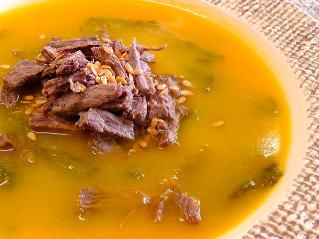

Ontem não nos apetecia fazer nada de muito elaborado para o jantar. Decidimos fazer uma sopa visto que já há algum tempo que não fazíamos cá em casa (é Verão, sopa não é propriamente o que apetece mais...).

  

Uma das memórias mais antigas que tenho é da minha mãe a dar-me sopa com lombinhos de carapau (ainda hoje me cresce água na boca quando me recordo nham). Com esta ideia na cabeça, tendo em conta os legumes que tinha em casa do [Prove](http://www.prove.com.pt/) e as opções de carne no congelador, decidi fazer uma sopa de nabiça com carne de vaca desfiada.

  

  

Sopa de Nabiça com Carne

**Ingredientes (para 6 doses de 200 ml)**

[Chuchú](http://pt.wikipedia.org/wiki/Chuchu), 2 pequenos

Abóbora, 400 gr.

Cebola, 2 médias

Cenoura, 1

Nabiça, meio molho

Carne de vaca para estufar, 300 gr.

Água, q.b.

Azeite, q.b.

Sal, q.b.

Sementes de linhaça, q.b.

  

**Preparação**

Colocar a carne a cozer numa panela com água e sal. Cozinhar todos os legumes, com excepção das nabiças, com água e sal. No final triturar os legumes já cozidos com uma varinha mágica para fazer um puré.  Adicionar folhas da nabiça cortadas em pedaços e deixar cozinhar. Adicionar um fio de azeite no final da cozedura da nabiça. Servir a sopa com a carne desfiada e algumas sementes de linhaça.
