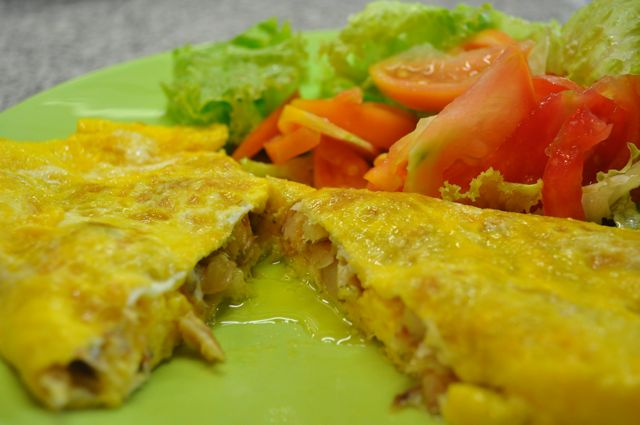
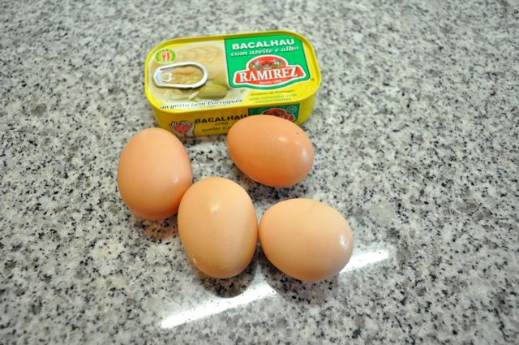
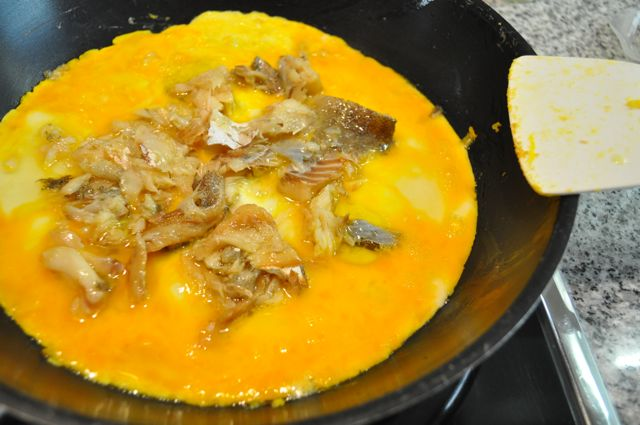

Mais uma semana complicada... segunda-feira e já estou a necessitar de fim-de-semana.  
  
Quando estive a trabalhar em Espanha comi várias vezes uma "tortilla de bacalao", que era maravilhosa. Recentemente, foi-me dado a conhecer um enlatado de bacalhau (tipo sardinhas) que comprei no fim-de-semana. Hoje lembrei-me de fazer uma omelete de bacalhau para o jantar (acompanhado de uma salada e precedido de uma sopa de alho-francês). Fica a receita que é muito simples e rápida.  
  

  
Omelete de Bacalhau  
**Ingredientes (para 1 pessoa)**  
Lata de bacalhau Ramirez, 1  
Ovos caseiros pequenos, 4  
Azeite, q.b.  
Sal, q.b.  
  
  
**Preparação**  
O bacalhau tem pele. Se não gostar, escorrer o bacalhau, colocar num prato e retirar a pele. Partir o bacalhau em pedaços pequenos. Bater os ovos com um pouco de sal. Colocar uma frigideira a aquecer com um pouco de azeite. Verter os ovos para a frigideira e colocar o bacalhau por cima. Quando a cozedura do ovo permitir, dobrar as pontas para fazer a omelete. Servir com uma salada de alface e tomate.  
  

