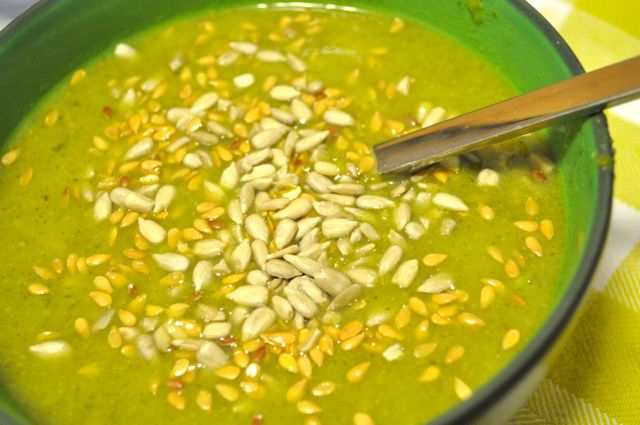
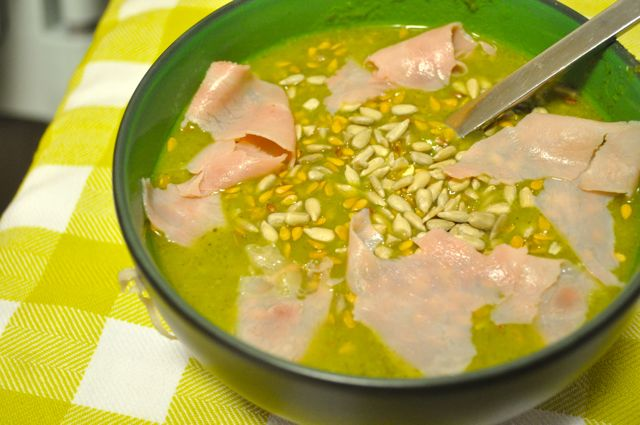

Hoje o jantar foi uma sopa de ervilhas que a mãe da Vânia fez. Eu compus a minha com algumas sementes e fiambre para aumentar a quantidade de proteina da refeição. Fica a receita.  
  

A versão simples

  

A versão completa

  
  
Sopa de Ervilhas "à Lavradora"  
**Ingredientes**  
Acelga, 8 folhas  
Courgette, 1  
Ervilhas, 200 gr  
Cenoura, 1  
Nabo, 1 pequeno  
Coentros, 1 colher de sopa  
Cebola, 1  
Alho, 1 dente  
Fiambre, 10 fatias  
Sementes de Linhaça, q.b.  
Sementes de Girassol, q.b.  
Água, q.b.  
Sal, q.b.  
Pimenta, q.b.  
Azeite, q.b.  
  
**Preparação**  
Cozer a acelga, a courgette, metade das ervilhas, a cenoura, os coentros, o nabo, a cebola e o alho. Triturar tudo e adicionar azeite. Rectificar os temperos. Juntar as restantes ervilhas e deixar cozinhar. Acompanhar com sementes de linhaça, girassol e fatias de fiambre cortadas em pedaços pequenos.
