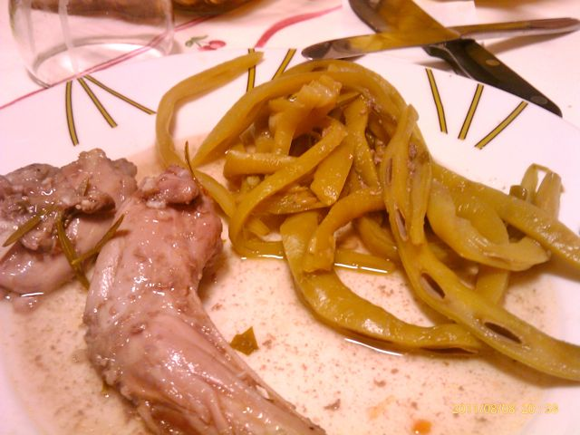

Ontem jantei na casa da minha mãe que fez coelho, que tem um gosto especial por levar alecrim. Acompanhámos com feijão verde cozido. Fica a receita.  
  

  
Coelho com alecrim ("à moda da minha mãe")  
**Ingredientes (para 6 pessoas)**  
Feijão verde, 600 gr.  
Coelho grande, 1  
Alhos, 3 dentes  
Cebola, 2  
Louro, 2 folhas  
Tomate maduros, 3  
Vinho tinto, 1 copo pequeno  
Salsa, q.b.  
Alecrim, q.b.  
Sal, q.b.  
Pimenta, q.b.  
Azeite, q.b.  
  
**Preparação**  

1. Doze horas antes de confeccionar, lavar bem o coelho e cortar em pedaços. Colocar a carne num recipiente e temperar com sal, pimenta, louro e água bem fria.
2. Num tacho suficientemente grande fazer um refogado pouco puxado, com azeite, alhos, cebola e tomate. 
3. Adicionar o coelho, vinho tinto, salsa picada e alecrim. Deixar cozer em lume branco.
4. Arranjar e cozer o feijão verde.
5. Servir colocando um pouco do molho por cima do feijão.
