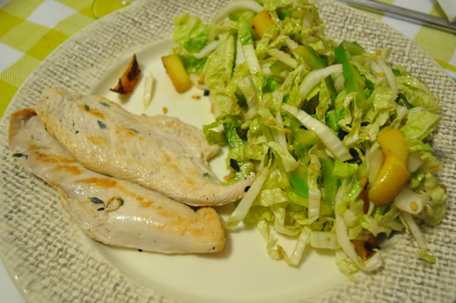
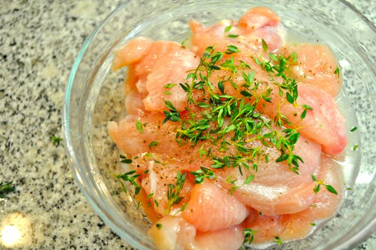
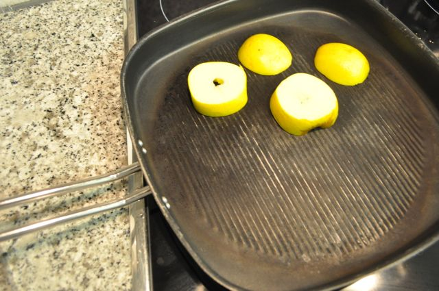
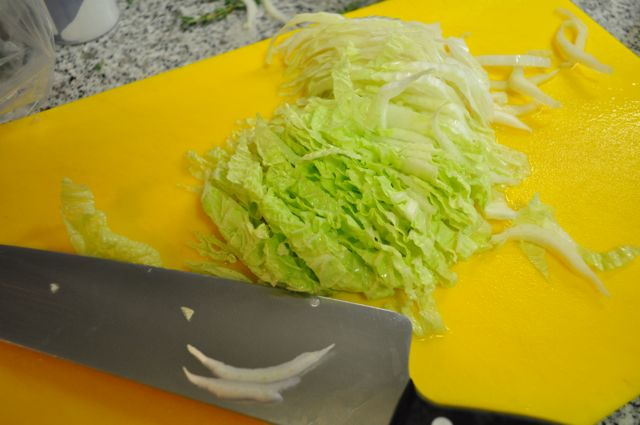
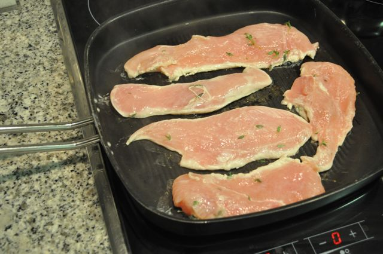

Hoje o jantar foi peito de frango com tomilho e limão grelhado, acompanhado de salada de acelga, pimento e maçã. Uma refeição leve, saborosa e fácil de fazer.  

  

  

Peitos de frango com tomilho e limão grelhados

**Ingredientes (para 2 pessoas)**

Peitos de frango, 2

Limão, 1

Tomilho, 5 hastes

Pimenta, q.b.

Acelga, 8 folhas

Maçã pequena, 1

Pimento verde, 1/4

Azeite, q.b.

Vinagre Balsâmico, q.b.

Sementes de linhaça, q.b.

Sal, q.b.

  

**Preparação**

1. Aquecer um grelhador de fogão. 
2. Cortar os peitos em bifinhos pequenos e colocar numa taça. Temperar com sal, pimenta, tomilho e o sumo do limão. Reservar.
3. Cortar a maçã em 4 fatias e grelhar.
4. Lavar a acelga, empilhar as folhas e cortar em tiras finas. Cortar os pimentos em tiras finas. Cortar a maçã grelhada em tiras. Juntar tudo numa taça com sementes de linhaça e temperar com azeite, vinagre balsâmico e sal. 
5. Grelhar a carne no grelhador de fogão.
6. Servir de imediato.

  

  

  

  

