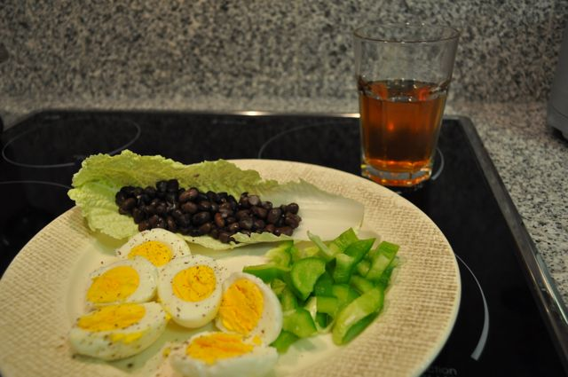

Outra semana complicada, a Inês esteve doente, o que não me deixou seguir o plano de jantares que tínhamos feito no fim-de-semana. Andei a semana toda a jantar sopa, fiambre, etc. Enfim... ossos do ofício.  

  

A um dia de completar 100 dias de alteração de dieta, fiz algumas medidas quantitativas:

- **Peso**: 76 kg (menos 11.5 Kg do que no início)
- **Perímetro Abdominal**: 93 cm (menos 9 cm do que no início)

  
Hoje resolvi experimentar uma versão diferente de pequeno-almoço, que junta uma das alternativas do meu plano (ou seja, sobras de jantar), com a dieta "slow-carb" descrita no livro "4 Horas por Semana, O Corpo" (cuja leitura iniciei esta semana). 

  

O resultado foi: ovos cozidos com uma folha de acelga, feijão preto e pimento verde cru. Tudo "regado" com um chá verde com canela (colocar as saquetas de chá e paus de canela num recipiente e juntar água a ferver). Como uma lata de feijão era muito para comer logo de manhã, levei o restante numa caixa pequena com algumas sementes de linhaça, para juntar aos legumes e carne do almoço.

  

A escolha de legumes não parecia muito feliz mas estava com pressa e as alternativas que tinham sobrado do [Prove](http://www.prove.com.pt/) não me permitiam fazer algo rápido. Ao contrário do que eu julguei, o pimento estava óptimo, fresco e estaladiço, soube muito bem e não tive qualquer tipo de azia ou mal estar. Para repetir de certeza. 

  

Resultado deste pequeno-almoço mais reforçado e de ter levado o feijão para o almoço: menos fome durante a manhã e tarde, traduzindo-se na prática em menos amêndoas/sementes de girassol e zero peças de fruta. Interessante, acho que vou experimentar durante uma semana para testar se acentua a perda de gordura.

  

